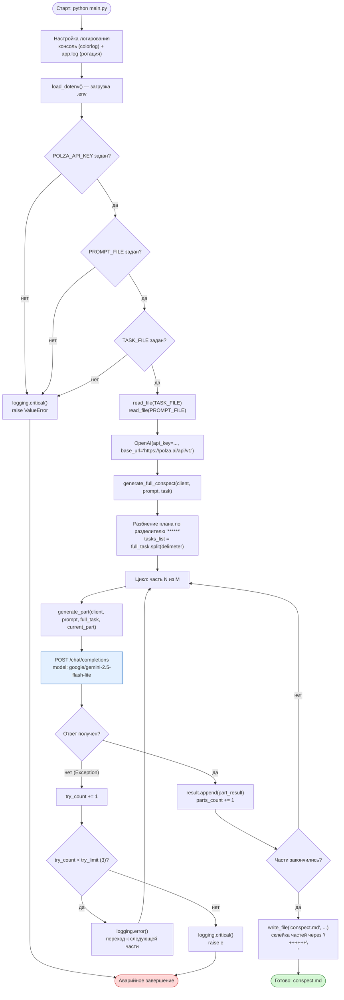
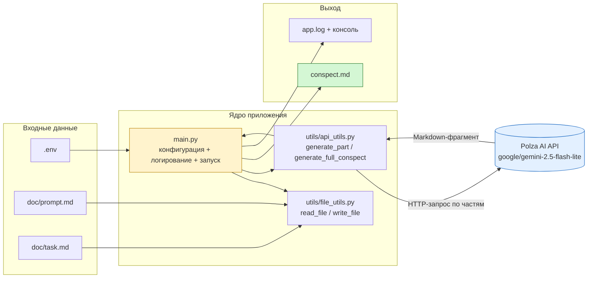
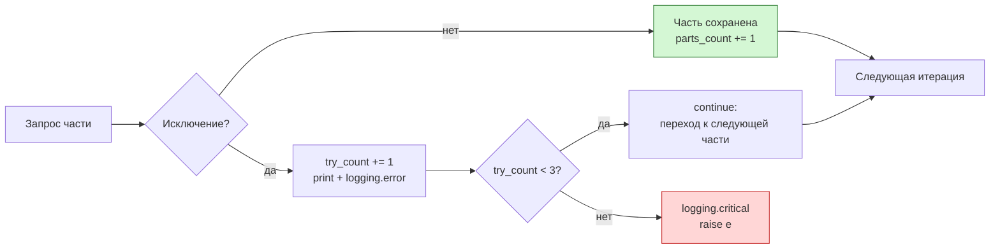

# Conspect Generator

CLI-приложение на Python, которое превращает **промпт-инструкцию** и **план статьи** в готовый связный Markdown-конспект. План разбивается на фрагменты, каждый фрагмент отправляется в LLM отдельным запросом, а ответы склеиваются в один файл `conspect.md`.

Работает через **Polza AI** (OpenAI-совместимый API), модель — `google/gemini-2.5-flash-lite`.

---

## Содержание

- [Быстрый старт](#быстрый-старт)
- [Как это работает](#как-это-работает)
- [Структура проекта](#структура-проекта)
- [Модули и их ответственность](#модули-и-их-ответственность)
- [Конфигурация](#конфигурация)
- [Развёртывание через UV](#развёртывание-через-uv)
- [Развёртывание через venv + pip](#развёртывание-через-venv--pip)
- [Шпаргалка: UV ↔ pip](#шпаргалка-uv--pip)
- [Подготовка входных документов](#подготовка-входных-документов)
- [Запуск и результат](#запуск-и-результат)
- [Логирование](#логирование)
- [Обработка ошибок](#обработка-ошибок)
- [.gitignore](#gitignore)
- [Известные особенности кода](#известные-особенности-кода)
- [Устранение неполадок](#устранение-неполадок)

---

## Быстрый старт

```bash
git clone <URL_РЕПОЗИТОРИЯ> net-411-last
cd net-411-last
uv sync
cp .env.example .env      # затем вписать свой POLZA_API_KEY
uv run python main.py
```

Результат появится в файле `conspect.md` в корне проекта.

---

## Как это работает

Приложение построено вокруг простой идеи: большую статью надёжнее генерировать **по частям**, чем одним запросом. Каждая часть получает полный план (для контекста) и свой конкретный фрагмент (для границ задачи), поэтому модель не уходит в соседние темы и не повторяется.



Ключевые моменты:

- **Разделитель частей в плане** — `******` (шесть звёздочек). Именно по нему `generate_full_conspect` режет `task.md`.
- **Разделитель частей в результате** — `++++++`. Он проставляется при склейке в `conspect.md` и нужен, чтобы потом было видно границы фрагментов.
- В каждый запрос передаются **и промпт, и весь план, и текущий фрагмент** — модель знает, что уже раскрыто выше и что будет раскрыто ниже.

---

## Структура проекта

```
net-411-last/
├── main.py                  # Точка входа: конфиг, логирование, оркестрация
├── pyproject.toml           # Метаданные проекта и зависимости (PEP 621)
├── uv.lock                  # Зафиксированные версии всех зависимостей
├── .env                     # Секреты и пути (НЕ коммитится)
├── .env.example             # Шаблон .env
├── .gitignore
├── README.md
├── conspect.md              # ← результат работы приложения
├── app.log                  # ← лог с ротацией (создаётся автоматически)
├── doc/
│   ├── prompt.md            # Системный промпт для модели (роль, стиль, правила)
│   └── task.md              # Полный план статьи, разбитый разделителями ******
└── utils/
    ├── __init__.py
    ├── api_utils.py         # generate_part, generate_full_conspect
    └── file_utils.py        # read_file, write_file
```

---

## Модули и их ответственность



| Модуль | Функция | Назначение |
|---|---|---|
| `main.py` | — | Точка входа. Проверяет переменные окружения, настраивает логирование, создаёт клиент `OpenAI`, запускает генерацию, записывает результат |
| `utils/file_utils.py` | `read_file(path) -> str` | Читает текстовый файл в UTF-8, при `FileNotFoundError` пишет ошибку в лог и пробрасывает исключение |
| | `write_file(path, content) -> None` | Перезаписывает файл в UTF-8, логирует начало и успех записи |
| `utils/api_utils.py` | `generate_part(client, prompt, full_task, current_part) -> str \| None` | Собирает итоговый промпт из трёх частей и выполняет один запрос к модели, возвращает текст фрагмента |
| | `generate_full_conspect(client, prompt, full_task, delimeter="******") -> list[str]` | Режет план на фрагменты, последовательно вызывает `generate_part`, считает ошибки и возвращает список готовых частей |

---

## Конфигурация

Скопируйте шаблон и заполните свои значения:

```bash
cp .env.example .env
```

```ini
POLZA_API_KEY=ВВЕДИТЕ_СВОЙ_КЛЮЧ
IS_IMAGE=True
PROMPT_FILE="./doc/prompt.md"
TASK_FILE="./doc/task.md"
```

| Переменная | Обязательна | Описание |
|---|---|---|
| `POLZA_API_KEY` | ✅ да | API-ключ сервиса Polza AI. Без него приложение падает с `ValueError` |
| `PROMPT_FILE` | ✅ да | Путь к файлу с системным промптом (`doc/prompt.md`) |
| `TASK_FILE` | ✅ да | Путь к файлу с планом статьи (`doc/task.md`) |
| `IS_IMAGE` | ❌ нет | Читается в `main.py` (как `IS_PAID`), но в логике пока не используется — зарезервировано под будущее ветвление |

> [!WARNING]
> В путях **обязательно указывайте расширение файла** — `./doc/prompt.md`, а не `./doc/prompt`. Функция `read_file` открывает путь как есть, и при отсутствии расширения вы получите `FileNotFoundError`.

> [!IMPORTANT]
> Файл `.env` содержит секретный ключ и **не должен попадать в Git**. В репозиторий коммитится только `.env.example` с заглушками.

---

## Развёртывание через UV

[UV](https://docs.astral.sh/uv/) — современный менеджер Python-проектов от Astral. Он сам создаёт `.venv`, сам ставит зависимости и сам запускает код внутри окружения, поэтому отдельная активация не нужна.

### 1. Установка UV

**Linux / macOS:**

```bash
curl -LsSf https://astral.sh/uv/install.sh | sh
```

**Windows (PowerShell):**

```powershell
powershell -ExecutionPolicy ByPass -c "irm https://astral.sh/uv/install.ps1 | iex"
```

Проверка:

```bash
uv --version
```

### 2. Клонирование и установка зависимостей

```bash
git clone <URL_РЕПОЗИТОРИЯ> net-411-last
cd net-411-last
```

```bash
uv sync
```

`uv sync` прочитает `pyproject.toml` и `uv.lock`, при необходимости скачает нужный интерпретатор Python (в проекте указано `requires-python = ">=3.14"`), создаст директорию `.venv` и установит в неё точные зафиксированные версии всех пакетов — включая транзитивные зависимости.

Если нужный интерпретатор ещё не установлен, UV сделает это сам. Явный вариант:

```bash
uv python install 3.14
```

### 3. Настройка окружения

```bash
cp .env.example .env
```

Откройте `.env` и впишите реальный `POLZA_API_KEY`.

### 4. Проверка состава окружения

```bash
uv pip list
```

### 5. Запуск

```bash
uv run python main.py
```

или короче:

```bash
uv run main.py
```

### 6. Если нужно добавить/обновить зависимости

```bash
uv add python-dotenv openai colorlog   # добавить пакеты
uv remove colorlog                     # удалить пакет
uv lock --upgrade                      # пересобрать lock-файл
uv sync                                # привести .venv в соответствие с lock-файлом
```

> [!TIP]
> Команда `uv add` не только устанавливает пакет, но и сразу прописывает его в `pyproject.toml` и обновляет `uv.lock`. Ручное редактирование этих файлов при работе с UV обычно не требуется.

---

## Развёртывание через venv + pip

Классический способ — он пригодится, если UV недоступен или вы разворачиваете проект на сервере с минимальным набором инструментов.

### 1. Создание виртуального окружения

```bash
python -m venv .venv
```

### 2. Активация окружения

**Linux / macOS (bash, zsh):**

```bash
source .venv/bin/activate
```

**Windows (PowerShell):**

```powershell
.venv\Scripts\Activate.ps1
```

**Windows (cmd.exe):**

```cmd
.venv\Scripts\activate.bat
```

После активации в начале строки терминала появится префикс `(.venv)`.

> [!NOTE]
> Если PowerShell блокирует запуск скриптов, выполните один раз:
> `Set-ExecutionPolicy -ExecutionPolicy RemoteSigned -Scope CurrentUser`

### 3. Обновление pip и установка зависимостей

```bash
python -m pip install --upgrade pip setuptools wheel
```

```bash
pip install "openai>=3.6.0" "python-dotenv>=0.9.9" "colorlog>=6.12.0"
```

Или из `requirements.txt`, если он есть в репозитории:

```bash
pip install -r requirements.txt
```

Содержимое `requirements.txt`:

```text
openai>=3.6.0
python-dotenv>=0.9.9
colorlog>=6.12.0
```

### 4. Настройка окружения

```bash
cp .env.example .env
```

Заполните `POLZA_API_KEY`.

### 5. Запуск

```bash
python main.py
```

### 6. Фиксация зависимостей и выход

```bash
pip freeze > requirements.txt
deactivate
```

> [!IMPORTANT]
> `pip freeze` фиксирует **все** установленные пакеты с точными версиями, включая транзитивные. Именно поэтому `requirements.txt` и директорию `.venv` не стоит путать: в Git попадает список зависимостей, а не само окружение.

---

## Шпаргалка: UV ↔ pip

| Действие | UV | venv + pip |
|---|---|---|
| Установить инструмент | `curl -LsSf https://astral.sh/uv/install.sh \| sh` | входит в поставку Python |
| Создать окружение | `uv venv` / автоматически при `uv sync` | `python -m venv .venv` |
| Активировать окружение | не требуется | `source .venv/bin/activate` |
| Установить все зависимости | `uv sync` | `pip install -r requirements.txt` |
| Добавить зависимость | `uv add openai` | `pip install openai` + правка `requirements.txt` |
| Задать конкретную версию | `uv add "requests==2.31.0"` | `pip install requests==2.31.0` |
| Удалить зависимость | `uv remove openai` | `pip uninstall openai` |
| Обновить зависимости | `uv lock --upgrade && uv sync` | `pip install --upgrade <пакет>` |
| Посмотреть установленное | `uv pip list` | `pip list` |
| Зафиксировать версии | `uv.lock` (автоматически) | `pip freeze > requirements.txt` |
| Запустить приложение | `uv run python main.py` | `python main.py` |
| Выйти из окружения | не требуется | `deactivate` |

Главное отличие: **UV объединяет управление окружением, зависимостями и запуском в одном инструменте**, тогда как классический подход требует координации `venv`, `pip` и отдельного `requirements.txt`.

---

## Подготовка входных документов

### `doc/prompt.md`

Системный промпт: роль модели, стиль текста, правила оформления Markdown, требования к выноскам, таблицам, Mermaid-диаграммам и запретам (не писать заключение, не раскрывать чужие разделы и т. д.). Этот файл передаётся в каждый запрос без изменений.

### `doc/task.md`

Полный план статьи. Фрагменты отделяются строкой из шести звёздочек:

```text
Что такое виртуальное окружение в Python?
Знакомство с концепцией окружения
Что такое окружение?
Из чего состоит окружение Python-проекта?
******
Зачем вообще нужны виртуальные окружения?
Проблема конфликтующих зависимостей
Воспроизводимость проекта
******
Как устроено виртуальное окружение?
Что появляется после создания окружения
Что означает активация окружения
```

Каждый блок между `******` уходит в отдельный запрос к модели. Чем мельче фрагменты — тем выше управляемость, но тем больше запросов и дольше общая генерация.

> [!TIP]
> Разделитель можно изменить, передав его явно в `main.py`:
> `generate_full_conspect(client, prompt_file, task_file, delimeter="------")`

---

## Запуск и результат

```bash
uv run python main.py
```

Во время работы в терминал печатается прогресс:

```text
14:32:07 | INFO     | utils.api_utils | Генерация части 1 из 12 началась
Генерация части 1 из 12 началась
14:32:41 | INFO     | utils.api_utils | Генерация части 2 из 12 завершена
...
14:41:19 | DEBUG    | utils.file_utils | Начинается запись в файл conspect.md
14:41:19 | DEBUG    | utils.file_utils | Файл conspect.md успешно записан
```

Файл `conspect.md` — это склеенные фрагменты, разделённые маркером `++++++`:

```markdown
## Что такое виртуальное окружение в Python?
...текст первого фрагмента...
++++++
## Зачем вообще нужны виртуальные окружения?
...текст второго фрагмента...
```

Перед публикацией маркеры `++++++` удаляются любым удобным способом:

```bash
sed -i '/^++++++$/d' conspect.md
```

> [!WARNING]
> `write_file` открывает файл в режиме `"w"`, то есть **полностью перезаписывает** существующий `conspect.md`. Каждый запуск создаёт результат с нуля — предыдущую версию нужно сохранять вручную или держать под Git.

---

## Логирование

Логируются одновременно два потока: цветной вывод в терминал и файл `app.log` с ротацией.

| Параметр | Значение |
|---|---|
| Уровень | `DEBUG` (пишется всё) |
| Консоль | `StreamHandler` + `ColoredFormatter` (colorlog), время в формате `%H:%M:%S` |
| Файл | `RotatingFileHandler("app.log")` |
| Размер файла | 2 МБ (`1024 * 1024 * 2`) |
| Количество бэкапов | 3 (`app.log.1`, `app.log.2`, `app.log.3`) |
| Кодировка | UTF-8 |

Цветовая схема консоли:

| Уровень | Цвет |
|---|---|
| `DEBUG` | голубой |
| `INFO` | зелёный |
| `WARNING` | жёлтый |
| `ERROR` | красный |
| `CRITICAL` | белый на красном фоне |

Чтобы снизить шум, поменяйте уровень в `main.py`:

```python
logging.basicConfig(
    level=logging.INFO,  # вместо DEBUG
    ...
)
```

---

## Обработка ошибок

В `generate_full_conspect` заложен простой механизм отказоустойчивости:



Поведение по типам сбоев:

| Ситуация | Реакция приложения |
|---|---|
| Нет `POLZA_API_KEY` | `CRITICAL` в лог + `ValueError`, запуск прекращается |
| Нет `PROMPT_FILE` или `TASK_FILE` | `CRITICAL` в лог + `ValueError`, запуск прекращается |
| Файл не найден на диске | `read_file` логирует `ERROR` и пробрасывает `FileNotFoundError` |
| Сбой одного запроса к API | Печатается ошибка, счётчик растёт, генерация продолжается со следующей части |
| Три и более сбоя суммарно | `CRITICAL` в лог + повторный `raise`, работа прерывается |
| Ошибка записи файла | `write_file` логирует `ERROR` и пробрасывает исключение |

> [!NOTE]
> Счётчик `try_count` **общий на весь прогон и не сбрасывается** после успешных частей. При лимите `3` приложение прервётся на третьей суммарной ошибке, даже если они произошли в разных фрагментах. В результате список частей может оказаться короче плана.

---

## .gitignore

```gitignore
# Виртуальное окружение
.venv/
venv/
env/

# Секреты
.env

# Python
__pycache__/
*.py[cod]
*.egg-info/

# Артефакты работы приложения
app.log
app.log.*
conspect.md
```

В репозитории должны оставаться: исходный код (`main.py`, `utils/`), конфигурация зависимостей (`pyproject.toml`, `uv.lock` или `requirements.txt`), входные документы (`doc/prompt.md`, `doc/task.md`), шаблон `.env.example` и `README.md`.

---

## Известные особенности кода

Небольшие моменты, на которые стоит обратить внимание перед первым запуском:

1. **Служебные строки в `main.py`.** В файле остались строки-комментарии вида `uv add load_dotenv` и `uv add colorlog` без символа `#`. Это невалидный Python — их нужно удалить или закомментировать.

2. **Пакет `dotenv` vs `python-dotenv`.** В `pyproject.toml` указан `dotenv`, а импорт в коде — `from dotenv import load_dotenv`. Корректный и поддерживаемый пакет называется **`python-dotenv`**; именно его и стоит добавить:
   ```bash
   uv remove dotenv
   uv add python-dotenv
   ```

3. **Лишний импорт в `api_utils.py`.** Строка `from unittest import result` не используется и может быть удалена.

4. **Несовпадение имён переменных.** В `.env` объявлена `IS_IMAGE`, а читается `getenv("IS_PAID")`. Значение в любом случае не влияет на логику, но имена лучше привести к одному виду.

5. **Расширения файлов в `.env`.** Пути должны заканчиваться на `.md` (см. предупреждение в разделе [Конфигурация](#конфигурация)).

6. **Отсутствие `utils/__init__.py`.** Импорт `from utils.file_utils import ...` предполагает, что `utils` — пакет. Если возникает `ModuleNotFoundError`, создайте пустой файл `utils/__init__.py`.

---

## Устранение неполадок

| Симптом | Вероятная причина | Решение |
|---|---|---|
| `ValueError: Не найден ключ API` | Пустой или отсутствующий `POLZA_API_KEY` | Проверить `.env`, перезапустить приложение |
| `FileNotFoundError: ./doc/prompt` | В `.env` путь без расширения | Указать `./doc/prompt.md` |
| `ModuleNotFoundError: No module named 'dotenv'` | Не установлен `python-dotenv` | `uv add python-dotenv` или `pip install python-dotenv` |
| `ModuleNotFoundError: No module named 'utils'` | Запуск не из корня проекта или нет `__init__.py` | Запускать из корня, создать `utils/__init__.py` |
| В `conspect.md` одна часть вместо десяти | В `task.md` нет разделителей `******` | Расставить разделители между фрагментами плана |
| Ошибки `401 Unauthorized` / `403` от API | Неверный или отозванный ключ | Перевыпустить ключ в Polza AI |
| Ошибки `429` / таймауты | Превышен лимит запросов | Уменьшить частоту, повторить запуск позже |
| `SyntaxError` в `main.py` | Незакомментированные строки `uv add ...` | Удалить или закомментировать их |
| Приложение не использует Python 3.14 | Окружение создано другим интерпретатором | `uv python install 3.14 && uv sync` |