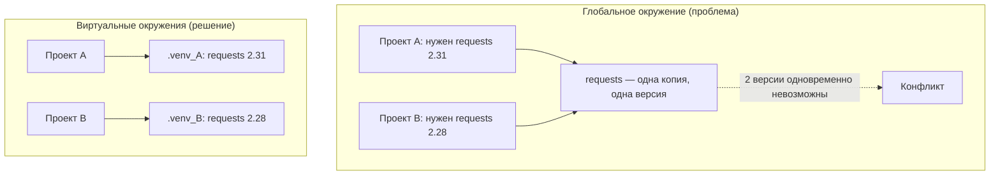
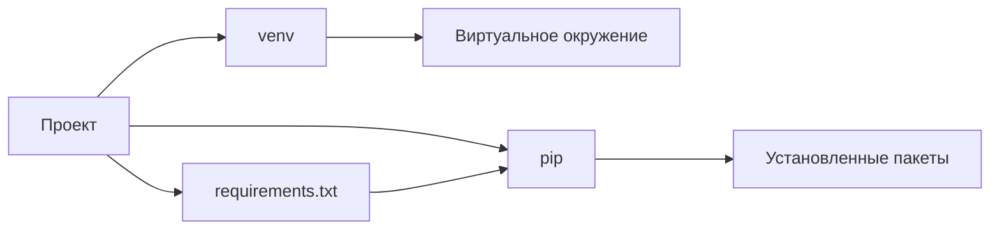

## Что такое виртуальное окружение в Python?

### Знакомство с концепцией окружения

Программа на Python почти никогда не существует изолированно от остального мира. Её код, данные и настройки образуют то, что обычно понимают под проектом, но для запуска этого кода нужен ещё и набор внешних условий: интерпретатор Python, установленные библиотеки, их версии, доступ к модулям и другим частям программы. Всё это вместе и называют **окружением (environment)** — средой, в которой проект реально выполняется.

В самом широком смысле окружение — это совокупность компонентов, доступных программе во время работы. Для Python-проекта важнее всего два компонента: **Python-интерпретатор** — программа, которая читает и выполняет код на Python, — и внешние библиотеки, от которых этот код зависит. Если проект использует только стандартную библиотеку Python и не обращается к сторонним модулям, окружение может казаться чем-то простым: достаточно запустить файл интерпретатором. Однако уже в небольших профессиональных проектах ситуация быстро усложняется: появляются сторонние библиотеки, у каждой из них есть своя версия, и поведение программы зависит от того, какие именно версии установлены.

Большинство проектов зависят от внешних библиотек. **Зависимость** — это сторонняя библиотека или инструмент, который нужен проекту для работы. Например, приложение может зависеть от библиотеки для работы с изображениями, от инструмента для отправки сетевых запросов или от фреймворка для создания веб-сервиса. Такие библиотеки распространяются в виде **пакетов** — устанавливаемых единиц распространения кода, которые содержат модули Python и служебную информацию. Когда разработчик устанавливает пакет, он не просто копирует файлы: пакет становится доступен проекту как часть среды выполнения.

Вот почему окружение так важно при работе над проектом. Один и тот же исходный код может вести себя по-разному в разных средах. Если проект рассчитан на определённый набор библиотек и их совместимость, случайный запуск в неподходящем окружении может привести к ошибкам. Например, код может использовать функцию, которой нет в более старой версии библиотеки, или, наоборот, опираться на поведение, которое изменилось в новой версии. Поэтому профессиональный проект — это не только `.py`-файлы, но и понимание того, в какой среде он должен выполняться.

Особенность многих Python-проектов состоит в том, что разные программы могут требовать несовместимые версии одной и той же библиотеки. Это обычная ситуация. Одна библиотека развивается, меняет интерфейс, исправляет ошибки или добавляет новую функциональность. Новый веб-сервис может требовать версию `requests` 2.x, а старый скрипт для автоматизации — всё ещё работать с поведением версии 1.x. Аналогично один проект может нуждаться в определённой версии Django, а другой — в другой версии того же Django, потому что они создавались и поддерживаются в разное время.

Если устанавливать все библиотеки в одно общее пространство, возникает несколько серьёзных проблем. Во-первых, разные проекты начинают конкурировать за одни и те же установленные версии. Во-вторых, обновление библиотеки для одного проекта автоматически влияет на все остальные проекты, которые используют это же окружение. В-третьих, если два проекта требуют несовместимые версии одной и той же библиотеки, возникает конфликт: нельзя одновременно иметь две разные версии одной библиотеки там, где они ищутся из одного общего списка. В-четвёртых, со временем в глобальном окружении накапливается большое количество пакетов, установленный для разных задач, и становится сложно понять, что именно нужно проекту и какие зависимости действительно используются.

Глобальная установка всех библиотек «на один компьютер» также затрудняет переносимость проекта. На одном устройстве может быть установлена библиотека нужной версии, а на другом — уже более свежая. Без изолированного окружения разработчик рискует получить ситуацию, когда программа работает локально, но не запускается у коллеги или на сервере, потому что зависимости там установлены иначе.

### Глобальное и виртуальное окружение

Когда Python устанавливается в систему или используется как общедоступный интерпретатор, он обычно имеет по умолчанию то, что называют **глобальным окружением Python**. Это окружение, к которому интерпретатор обращается в обычном режиме: если установить в него библиотеку, она станет доступна всем проектам, которые используют этот Python и не переопределили место поиска модулей. В глобальном окружении хранятся общие пакеты, установленные для всей системы или текущего пользователя.

Глобальное окружение удобно для быстрых экспериментов, потому что один раз установленный пакет доступен везде. Однако в разработке программного обеспечения такая доступность одновременно является и недостатком: общий ресурс начинает связывать проекты между собой. Если один разработчик обновляет общую библиотеку, это может нечаянно повлиять на чужие рабочие сценарии. Если на компьютере несколько проектов с разным набором зависимостей, они начинают конкурировать за пространство имён Python-модулей.

**Виртуальное окружение** решает эту проблему. Виртуальное окружение — это изолированная среда, предназначенная для конкретного проекта. В ней есть собственное пространство для установленных библиотек и собственное представление о том, какие модули доступны. Технически виртуальное окружение можно представить как отдельную область, связанную с определённым Python-интерпретатором, но при этом отделённую от глобального набора пакетов.

Виртуальное окружение можно представить как отдельный ящик с инструментами для конкретного проекта. Технически это не магическая копия всей операционной системы, а изолированная область, в которую устанавливаются нужные проекту библиотеки. Когда проект использует такое окружение, Python обращается к его списку модулей, и установленные здесь версии доступны именно этому проекту. Если другая версия той же библиотеки установлена в другом окружении, она не мешает первому проекту, пока оба они работают в своих средах.

Изоляция между проектами возникает за счёт разделения области поиска модулей. В глобальном окружении проекты видят один общий набор пакетов. В виртуальном окружении каждый проект имеет собственное место установки зависимостей. Поэтому обновление библиотеки в окружении одного проекта не приводит к автоматическому обновлению в другом проекте. Установка пакета для нового проекта не смешивается с пакетами, которые нужны старому сервису.

Важно различать глобальное и виртуальное окружение как два разных уровня организации разработки. Глобальное окружение отвечает за то, что доступно «по умолчанию всем». Виртуальное окружение отвечает за то, что нужно «конкретному проекту и только ему». Если в глобальном окружении установлены общие инструменты и несколько библиотек, они не обязательно станут частью каждого нового проекта, пока этот проект явно не будет настроен использовать глобальные модули. При работе через собственное виртуальное окружение проект получает отдельное пространство, где можно устанавливать, удалять и обновлять библиотеки без риска повлиять на чужие программы.

Виртуальное окружение обычно создаётся отдельно для каждого проекта, потому что каждый проект имеет собственную историю зависимостей. У него свой срок жизни, свои библиотеки, свои версии, свои обновления и свои ошибки, которые нужно воспроизводить в конкретной среде. Если несколько проектов использовать одно и то же виртуальное окружение, они снова оказываются связанными: изменение зависимостей в одном проекте может повлиять на другой. Поэтому стандартная практика — изоляция на уровне проекта: каждый Python-проект получает собственное окружение.

Такая организация делает проект более предсказуемым. Он зависит не от случайного накопления библиотек на компьютере разработчика, а от явно заданного состояния, созданного для него самого. Именно эта отделённость превращает виртуальное окружение из абстрактного термина в практический механизм управления зависимостями и безопасной работы с несколькими Python-проектами на одном устройстве.
++++++


## Зачем вообще нужны виртуальные окружения?

Концепция изолированного окружения становится особенно понятной, когда возникает конкретная ситуация, в которой без неё работа просто останавливается. Представим типичную картину: на одном рабочем компьютере разработчика находятся два проекта. Первый — небольшой веб-сервис на Django 4.2, который требует библиотеку `requests` версии 2.31. Второй — скрипт автоматизации отчётов, написанный ещё полгода назад и завязанный на `requests` 2.28, потому что в 2.31 изменилось поведение одной из функций, и скрипт после обновления перестаёт корректно обрабатывать ответы сервера.

Оба проекта используют одну и ту же библиотеку, но работают только с конкретными версиями. Если `requests` установлена глобально, на компьютере существует ровно один экземпляр этой библиотеки. Обновив `requests` до 2.31 для веб-сервиса, разработчик неизбежно ломает скрипт отчётов. Откатив версию обратно до 2.28, он, напротив, выводит из строя веб-сервис. Никакой выбор не устраивает одновременно оба проекта.

> [!WARNING]
> Проблема не ограничивается одной библиотекой. Одна и та же версия `requests` может конфликтовать с `urllib3`, та — с `certifi`, и в итоге обновление «одной» библиотеки на практике влечёт каскад изменений в десятках связанных пакетов.

### Проблема конфликтующих зависимостей

**Зависимость (dependency)** — это библиотека или модуль, без которого проект не может корректно работать. Когда один проект требует определённую версию библиотеки, а другой — другую, возникает то, что называют конфликтом версий. В Python такие конфликты особенно часты, потому что экосистема насчитывает сотни тысяч пакетов, каждый из которых имеет собственные требования к версиям окружающих его библиотек.

Ситуация усугляется с ростом числа проектов. На ноутбуке веб-разработчика легко набегается восемь-двенадцать активных репозиториев. Каждый из них тянет за собой свои десятки зависимостей, многие из которых пересекаются по названиям, но не по совместимым версиям. Управление одним глобальным набором пакетов при таком количестве пересечений превращается в бесконечный цикл обновлений и откатов, причём поломка одного проекта в результате изменения «ради другого» обнаруживается не сразу, а через несколько дней или при следующем запуске.

Виртуальное окружение решает эту проблему принципиально: каждый проект получает собственное пространство, в котором живёт свой независимый набор библиотек. Веб-сервис на Django видит `requests` 2.31 в своей директории `.venv`, скрипт отчётов видит `requests` 2.28 в своей. Они сосуществуют на одном диске, не пересекаясь и не влияя друг на друга. Никаких компромиссов по версиям и никаких каскадных поломок.



Практическое следствие этого подхода простое и одновременно очень важное: разработчик перестает думать о том, «какие версии у меня установлены глобально». Каждый проект самодостаточен по зависимостям, и работа в одном проекте никак не затрагивает файлы другого.

### Воспроизводимость проекта

Изоляция защищает от конфликтов на одном компьютере, но не отвечает на другой, не менее критичный вопрос: как гарантировать, что проект, работающий у одного разработчика, точно так же запустится у другого — на его машине, в его операционной системе, через месяц или год?

Чтобы проект запускался одинаково, необходимо знать не только список используемых библиотек, но и **конкретные версии** каждой из них, а также версии их транзитивных зависимостей — тех библиотек, которые тянутся автоматически как часть установки. Проект, в который просто записано «используется Django», не может быть корректно воспроизведён: Django 4.2 и Django 5.1 могут иметь несовместимые API, и запуск с неверной версией даст ошибки, которые трудно диагностировать.

Вот почему важно хранить информацию о зависимостях непосредственно в репозитории проекта. Другой разработчик, клонируя репозиторий, должен получить возможность точно воссоздать набор библиотек, на которых проект был написан и протестирован. Без этого воспроизводится только код, но не среда, в которой он работает, а это ровно половина успеха.

> [!IMPORTANT]
> Репозиторий проекта хранит описание зависимостей, но не само виртуальное окружение. Это два разных понятия: первое — данные, второе — исполняемая среда.

При этом само виртуальное окружение не передают вместе с кодом — не добавляют `.venv` в репозиторий и не рассылают его коллегам. На то есть несколько технических причин. Внутри виртуального окружения находятся скомпилированные бинарные файлы, пути к интерпретатору, привязанные к конкретной директории, и библиотеки, собранные под конкретную операционную систему и процессорную архитектуру. Директория `.venv`, созданная на Linux с Python 3.11 и архитектурой x86-64, не будет работать на macOS с Apple Silicon. Кроме того, типичное виртуальное окружение Python-проекта занимает от 50 МБ до нескольких гигабайт, что делает его размещение в Git-репозитории нецелесообразным даже при идеальной переносимости.

Что действительно нужно сохранять вместе с проектом — так это минимальную информацию, достаточную для пересоздания окружения с нуля. Обычно это перечень библиотек и их версий: в классическом подходе — текстовый файл с названиями пакетов и закреплёнными версиями, в современных инструментах — структурированный конфигурационный файл, о котором подробнее пойдёт речь в соответствующих разделах статьи. Суть одна: проект несёт с собой «рецепт», а не «готовое блюдо». Любой компьютер с установленным Python по этому рецепту способен собрать идентичное окружение за несколько минут, не перенося между машинами сотни мегабайт бинарных файлов.
++++++
## Как устроено виртуальное окружение?

### Что появляется после создания окружения

Виртуальное окружение — это не абстрактное состояние Python и не «режим работы» самого языка. После его создания в файловой системе появляется обычная директория. Именно она хранит пути к интерпретатору, месту для библиотек и исполняемым файлам, которые будут использоваться только этим проектом.

Такая директория может называться по-разному, но в практических примерах часто встречается имя `.venv`. Например, если проект лежит в каталоге `my_project`, его виртуальное окружение обычно создаётся рядом:

```text
my_project/
├── src/
│   └── app.py
└── .venv/
```

Самое важное здесь не в имени, а в содержании: внутри этой директории формируется отдельная точка входа для работы с Python.

| Элемент окружения | Примерное расположение | Зачем нужен |
| --- | --- | --- |
| Интерпретатор Python | `.venv/bin/python` на Unix и macOS или `.venv/Scripts/python.exe` на Windows | запускает проект и определяет, какие каталоги с библиотеками считаются рабочими |
| Каталоги для установленных библиотек | `.venv/lib/python3.x/site-packages` или `.venv/Lib/site-packages` | хранят пакеты, которые можно импортировать в коде |
| Каталоги исполняемых файлов | `.venv/bin` или `.venv/Scripts` | содержат команды утилит и запускные скрипты, установленные для проекта |

Путь к интерпретатору внутри виртуального окружения — это не обязательное требование хранить отдельную копию всего Python. На практике окружение использует базовую установку языка, но добавляет собственную область для пакетов и команд. Если бы каждая копия виртуального окружения содержала полноценный Python, каждый проект занимал бы значительно больше места, а обновления интерпретатора пришлось бы обрабатывать отдельно для каждого окружения.

Внутренне окружение связано с одной конкретной версией Python из основной установки. Например, на Unix-системах интерпретатор может находиться по пути `.venv/bin/python`, а на Windows — `.venv\Scripts\python.exe`. Когда такой интерпретатор запускается, он «понимает», что принадлежит каталогу `.venv`, и при поиске библиотек первым делом смотрит в его собственный каталог `site-packages`, а не только в глобальные хранилища Python.

**site-packages** — это служебный каталог Python, в который устанавливаются библиотеки, доступные для импорта в коде. Разные проекты должны иметь возможность хранить свои `site-packages` отдельно, чтобы одна и та же библиотека не попадала в общую для всех проектов область.

Виртуальное окружение также может содержать отдельные исполняемые файлы. Когда устанавливается пакет, предоставляющий собственную команду, например CLI-утилиту, Python создаёт запускной скрипт внутри окружения. На Unix-системах он попадает в `.venv/bin`, на Windows — в `.venv\Scripts`. Благодаря этому команды, связанные с библиотекой, не конкурируют с аналогичными командами из глобальной установки.

Например, если два проекта используют один инструмент, но требуют разные версии этого инструмента, каждое виртуальное окружение может иметь свою копию запускного файла и свои зависимости. При этом сам интерпретатор Python не создаёт полностью изолированную операционную систему: он изолирует пути поиска Python-библиотек и исполняемых файлов в рамках конкретного окружения.

> [!IMPORTANT]
> Виртуальное окружение не является полноценной копией всего Python. Оно указывает на базовую установку интерпретатора и добавляет собственный набор каталогов для пакетов и команд. Поэтому перемещение, удаление или серьёзное обновление основной установки Python может сделать окружение нерабочим.

### Что означает активация окружения

Создание виртуального окружения и активация — два разных события. Окружение появляется в файловой системе сразу после создания, но терминал ещё не обязан использовать именно его. Чтобы команды `python`, `pip` и другие инструменты указывали на выбранное окружение, его обычно активируют.

Активация меняет состояние текущей сессии терминала. В первую очередь она изменяет переменную **PATH**.

**PATH** — это переменная окружения операционной системы, которая содержит список каталогов. Когда в терминале вводится команда, система ищет исполняемый файл в тех каталогах, которые перечислены в `PATH`. Порядок этих каталогов важен: обычно первым используется найденный исполняемый файл из каталога, стоящего раньше.

До активации `PATH` может содержать системные каталоги, например пути к глобально установленному Python. После активации в начало списка добавляется каталог виртуального окружения, например `.venv/bin` на Unix или `.venv\Scripts` на Windows. В результате при вводе команды `python` терминал находит интерпретатор внутри `.venv`, а не тот, который используется глобально.

То же самое относится к `pip`, если он установлен внутри виртуального окружения. Команда `pip` начинает указывать на локальную версию инструмента, связанную с текущим окружением. Поэтому установленные библиотеки попадают не в глобальные `site-packages`, а в каталог библиотек этого окружения.

Активация обычно также добавляет в окружение переменную `VIRTUAL_ENV` с путём к директории виртуального окружения. Некоторые инструменты и скрипты могут использовать её, чтобы определить активное окружение. Кроме того, многие оболочки меняют вид приглашения, добавляя к строке подсказки имя окружения, например `.venv`. Это сделано для удобства: так разработчик сразу видит, в каком состоянии находится текущий терминал.

> [!NOTE]
> Изменение приглашения терминала — это визуальная подсказка, а не технический механизм изоляции. Если после активации команда `python` всё равно ссылается на другую версию, стоит проверить `PATH`: каталог виртуального окружения должен находиться раньше других мест, где может быть установлен Python.

Технически активация не обязательна. Виртуальное окружение работает и без неё, если запускать интерпретатор напрямую по полному пути. Например, можно выполнить файл с помощью интерпретатора из `.venv`, а не из глобального окружения. При таком запуске Python сам определит, что используется локальное окружение проекта, и будет искать библиотеки в его каталогах.

Активация удобна при ручной работе, потому что сокращает команды. Вместо явного указания длинного пути достаточно написать `python`, `pip` или установленную утилиту. Это особенно важно при интерактивной работе, запуске REPL, использовании инструментов, зависящих от активных скриптов, или когда нужно быстро переключаться между несколькими окружениями.

Однако активация имеет побочный эффект: она влияет только на текущую сессию терминала. Если закрыть окно терминала или выйти из окружения, изменения `PATH` и других переменных отменяются. Для автоматизации, скриптов и CI/CD-процессов часто предпочтительнее явно указывать путь к нужному интерпретатору или использовать инструменты, которые сами выбирают окружение проекта.
++++++
## Встроенные в Python инструменты для работы с окружением

Для практической работы с виртуальными окружениями в Python чаще всего используют два стандартных инструмента: `venv` и `pip`. Они решают разные задачи и часто применяются последовательно: `venv` создаёт изолированное окружение, а `pip` устанавливает внутри него библиотеки. Оба инструмента входят в стандартный состав Python, поэтому их можно найти в большинстве современных установок языка.

### venv

`venv` — стандартный модуль Python, который используется для создания виртуальных окружений. Он не устанавливает библиотеки проекта и не следит за версиями зависимостей. Его задача — подготовить отдельную директорию с собственным представлением интерпретатора Python и местами для установленных пакетов.

Самый привычный способ создать окружение — вызвать модуль `venv` как команду:

```bash
python -m venv .venv
```

Эта команда использует тот интерпретатор Python, который в данный момент доступен по имени `python`, и создаёт новое виртуальное окружение в каталоге `.venv`. Если на компьютере установлено несколько версий Python, лучше явно указывать нужный интерпретатор:

```bash
python3.12 -m venv .venv
```

или использовать путь к конкретному исполняемому файлу Python. Такой подход снижает риск случайно создать окружение не из той версии интерпретатора.

Каталог виртуального окружения можно назвать как угодно. В Python нет жёсткого требования, что он должен называться `.venv`. Однако это распространённое соглашение. Название `.venv` удобно сразу по нескольким причинам: оно показывает, что окружение относится к текущему проекту, точка в начале имени делает каталог скрытым по умолчанию в большинстве файловых менеджеров и терминальных утилит, а многие современные инструменты разработки ожидают увидеть именно `.venv`.

После создания окружение ещё не активно. Чтобы работать с ним через обычные команды `python` и `pip`, нужно активировать виртуальное окружение в текущей оболочке. Способ активации зависит от операционной системы и командного interpreterа.

| Среда | Команда активации |
|---|---|
| Linux, macOS, Bash, Zsh | `source .venv/bin/activate` |
| Windows, PowerShell | `.venv\Scripts\Activate.ps1` |
| Windows, cmd | `.venv\Scripts\activate.bat` |

При активации в оболочку добавляется набор переменных окружения и изменяется `PATH`. Проще говоря, `PATH` — это список папок, в которых система ищет исполняемые программы. При активации виртуального окружения каталог с исполняемыми файлами проекта, например `.venv/bin` или `.venv\Scripts`, помещается перед глобальными системными путями. Благодаря этому команды `python` и `pip` начинают запускаться из выбранного окружения.

При успешной активации часто меняется приглашение терминала, например появляется префикс с именем окружения. Это удобное, но не обязательное визуальное подтверждение. Главное техническое изменение — поиск команд и переменные окружения начинают указывать на конкретное виртуальное окружение.

Выход из активированного окружения выполняется командой:

```bash
deactivate
```

Эта команда не является отдельным исполняемым файлом Python. Она становится доступна в текущей оболочке после активации и восстанавливает прежнее состояние `PATH` и переменных окружения. Если просто закрыть терминал, активация тоже прекратится, потому что она относится только к текущему сеансу оболочки.

> [!TIP]
> Активация особенно удобна при ручной работе в терминале. Если известно точный путь к интерпретатору или менеджеру пакетов внутри окружения, их можно запускать напрямую, например через `.venv/bin/python` или `.venv/bin/pip`, без изменения состояния текущей оболочки.

### pip

`pip` — стандартный менеджер пакетов Python. Он устанавливает библиотеки из Python Package Index и управляет уже установленными пакетами внутри выбранного интерпретатора Python. `pip` не создаёт виртуальные окружения и не изолирует проекты друг от друга. Эти задачи относятся к другим инструментам, таким как `venv` или современные менеджеры проектов.

При создании виртуального окружения с помощью `venv` обычно автоматически устанавливается собственная версия `pip`. Поэтому внутри активированного окружения команда:

```bash
pip install requests
```

работает именно с этим окружением, а не с глобальным интерпретатором Python. Если окружение не активировано, можно вызывать `pip` напрямую из его каталога:

```bash
.venv/bin/pip install requests
```

или на Windows:

```powershell
.venv\Scripts\pip.exe install requests
```

Такой способ полезен в скриптах и автоматизации, когда не хочется зависеть от состояния текущей оболочки.

Установка библиотеки в простом случае выглядит так:

```bash
pip install requests
```

Без указания версии `pip` выберет подходящую по своим правилам версию пакета и установит её в текущее окружение. В реальных проектах часто бывает важно зафиксировать конкретную версию, чтобы избежать неожиданных изменений в коде или совместимости. Тогда используется точное указание версии:

```bash
pip install "requests==2.32.3"
```

Кавычки здесь желательны, потому что символы вроде `==`, `>=` или `<` могут по-разному интерпретироваться некоторыми оболочками. Если нужно установить версию выше определённой, но ниже другой, можно использовать более широкий диапазон версий:

```bash
pip install "requests>=2.30,<3.0"
```

Обновление пакета до более новой версии выполняется так:

```bash
pip install --upgrade requests
```

или с короткой формой:

```bash
pip install -U requests
```

После этого `pip` может выбрать более новую версию и, если это требуется для совместимости, изменить связанные пакеты. Поэтому обновление одной библиотеки иногда влияет не только на неё саму, но и на остальное окружение.

Удаление пакета выполняется командой:

```bash
pip uninstall requests
```

Обычно `pip` запрашивает подтверждение перед удалением. Он удаляет установленную версию пакета из текущего окружения. Если пакет был нужен другим установленным библиотекам, их работа может нарушиться, поэтому такие действия стоит выполнять осознанно.

Просмотреть список установленных пакетов можно так:

```bash
pip list
```

Эта команда показывает краткую информацию о пакетах, установленных в текущем Python-окружении. Для конкретного пакета удобнее использовать:

```bash
pip show requests
```

`pip show` выводит более подробные сведения: версию, описание, домашний URL, зависимости, установленный пакет или путь к нему. Это помогает быстро понять, какая именно версия библиотеки сейчас используется и почему она оказалась в окружении.

Важно различать роли `venv` и `pip`. `venv` отвечает за создание отдельного окружения, а `pip` — за установку и удаление пакетов внутри выбранного интерпретатора Python. Сам по себе `pip` не определяет, какое окружение использовать, если его вызывают без явного указания пути: он работает с тем Python, к которому привязан запуск команды. Поэтому активация окружения или прямой вызов `.venv/bin/pip` делают результат более предсказуемым.
++++++
## Базовая работа с venv и pip

### Типичный рабочий процесс

Когда структура `venv` и назначение `pip` уже понятны, их обычно используют вместе в одном коротком рабочем цикле. Такой цикл повторяется почти в каждом Python-проекте: создаётся папка проекта, в ней появляется изолированное окружение, после чего в это окружение устанавливаются библиотеки и оттуда же запускается код.

Начинается всё с обычной директории. Например, разрабатывается небольшой скрипт `app.py`, который обращается к внешнему сервису через библиотеку `requests`. Сначала проект создаётся независимо от окружения:

```bash
mkdir task-tracker
cd task-tracker
```

Эти команды создают папку `task-tracker` и переходят в неё. В реальных условиях разработчик также может поместить туда исходный код, данные, тесты и другие файлы проекта, но виртуальное окружение всё равно будет относительной частью этой директории.

После этого создаётся изолированное окружение:

```bash
python -m venv .venv
```

`python` — это интерпретатор Python, а `-m venv` означает «запустить встроенную модуль `venv` как скрипт». Модуль `venv` создаёт отдельную директорию окружения с именем `.venv`. Точка в начале имени является распространённым соглашением: она помогает визуально отделить служебные файлы проекта от основного кода и часто упрощает добавление этой директории в настройки системы контроля версий.

Если в системе недоступна команда `python`, но есть запускатель Python, например на Windows, может использоваться альтернативная команда:

```bash
py -m venv .venv
```

Смысл не меняется: Python создаёт новое локальное окружение в папке `.venv`.

Дальше окружение нужно активировать. Активация не устанавливает новые библиотеки и не создаёт их заново — она только указывает текущей оболочке терминала, какой именно интерпретатор и какие исполняемые файлы использовать при запуске команд. Для Linux и macOS это обычно делается так:

```bash
source .venv/bin/activate
```

В Windows PowerShell используется другой путь:

```powershell
.\.venv\Scripts\Activate.ps1
```

А в командной строке Windows:

```batch
.venv\Scripts\activate.bat
```

После успешной активации многие оболочки меняют приглашение: перед текущей строкой появляется название окружения, например:

```bash
(.venv) $
```

Это наглядный сигнал: терминал сейчас использует то окружение, которое находится в `.venv`. Проверить это можно командой:

```bash
python --version
```

Она покажет версию интерпретатора, к которому в данный момент обращает команда `python`.

Теперь библиотеку можно устанавливать внутрь активированного окружения:

```bash
pip install requests
```

`pip` загружает пакет `requests` и его собственные необходимые зависимости, а затем помещает их в каталог окружения. Важно понимать: эта библиотека устанавливается не «в систему вообще», а в конкретное окружение проекта.

Допустим, файл `app.py` содержит такой код:

```python
import requests

print(requests.__version__)
```

Запустить его нужно уже из окружения проекта:

```bash
python app.py
```

Если окружение активировано, команда `python` обращается к интерпретатору внутри `.venv`, который видит установленный туда пакет `requests`. В результате программа может импортировать библиотеку и использовать её.

Когда работа завершена, окружение можно отключить:

```bash
deactivate
```

Эта команда возвращает терминал к обычному состоянию. После деактивации `python` и `pip` снова могут относиться к глобальной установке Python, если она настроена в системе. При этом сам `.venv` остаётся в проекте и доступен для следующей активации — окружение никуда не исчезает.

Такой рабочий порядок — создать окружение, активировать его, установить нужные пакеты, запустить проект и при необходимости отключить окружение — является основой классической практики разработки на Python.

### Работа с зависимостями

В процессе разработки у проекта почти всегда появляются **зависимости**. **Зависимость** — это внешняя библиотека или пакет, без которых код проекта не может полноценно работать. Например, скрипт для работы с веб-сайтами может зависеть от библиотеки `requests`, а веб-приложение — от `Flask`. Сам код проекта при этом не хранит исходники всех чужих библиотек: он только использует установленные пакеты.

Зависимости делятся на два уровня. **Прямая зависимость** — это библиотека, которую разработчик использует непосредственно в своём коде. **Транзитивная зависимость** — это библиотека, которая не нужна проекту напрямую, но требуется одной из установленных библиотек. Например, приложение может импортировать `Flask` в своих модулях, а внутри `Flask` уже используются пакеты `Werkzeug` и `Jinja2`. Разработчик может не писать `import jinja2` в основном коде, но без `Jinja2` приложение всё равно не запустится.

Эти два вида зависимостей часто путают, хотя их роль в проекте разная. Для сравнения удобно представить небольшой веб-проект, который работает с HTTP-запросами:

| Тип зависимости | Что это означает в проекте | Пример |
| --- | --- | --- |
| Прямая зависимость | библиотека вызывается или конфигурируется разработчиком | `Flask`, `requests` |
| Транзитивная зависимость | библиотека нужна другой установленной библиотеке | `Jinja2`, `Werkzeug`, `urllib3` |

Когда устанавливается пакет через `pip`, менеджер автоматически подтягивает не только его, но и те библиотеки, которые нужны выбранному пакету. Поэтому один пакет `Flask` может привести к установке нескольких дополнительных пакетов.

Чтобы передать проект другим людям или воспроизвести его окружение, недостаточно просто хранить исходный код. Нужно где-то зафиксировать, какие библиотеки проект использует. В классическом workflow `venv` и `pip` для этого часто применяют файл `requirements.txt`.

Файл `requirements.txt` — это обычный текстовый список пакетов, из которых может восстанавливаться окружение проекта. Его можно создать вручную или сгенерировать на основе текущего окружения с помощью команды:

```bash
pip freeze > requirements.txt
```

Команда `pip freeze` выводит список установленных пакетов с точными версиями в формате, который понимает `pip`. Оператор `>` перенаправляет этот вывод в файл `requirements.txt`. В результате файл может выглядеть примерно так:

```text
blinker==1.8.2
certifi==2024.8.30
charset-normalizer==3.3.2
click==8.1.7
Flask==3.0.3
idna==3.7
Jinja2==3.1.4
requests==2.32.3
urllib3==2.2.2
Werkzeug==3.0.3
```

Теперь этот список можно использовать для установки пакетов в другое окружение. Если проект перенесли на другой компьютер или новый разработчик получил его исходный код, последовательность действий будет такой:

```bash
python -m venv .venv
source .venv/bin/activate
pip install -r requirements.txt
```

Команда `pip install -r requirements.txt` читает файл `requirements.txt`, проходит по списку пакетов и устанавливает их в активированное окружение. После этого проект получает тот же набор библиотек, который был зафиксирован ранее.

Здесь важно различать два действия: **сохранить текущее окружение** и **объявить зависимости проекта**. `pip freeze` сохраняет фактическое состояние установленного окружения. Это удобно для быстрого эксперимента или временного воспроизведения. Однако если разработчик случайно установил в окружение пакет, который проекту не нужен, он тоже попадёт в `requirements.txt`. Кроме того, файл может содержать много транзитивных зависимостей с очень точными версиями, хотя проекту на самом деле нужны только некоторые прямые библиотеки.

Поэтому при работе с классическим подходом следует помнить, что `requirements.txt` — это инструмент фиксации состояния, а не волшебная замена проектному мышлению. Хорошая привычка — периодически проверять, какие библиотеки действительно использует код проекта, и не переносить в файл лишние пакеты, установленные «на пробу».

> [!WARNING]
> `pip freeze` записывает все установленные в окружение пакеты, включая транзитивные зависимости и временные библиотеки. После команды лучше проверить содержимое `requirements.txt`, чтобы в нём не оказались лишние пакеты.

На практике восстановление проекта на новом месте чаще всего опирается не на перенос самой папки `.venv`, а на перенос исходного кода и файла с зависимостями. Это связано с тем, что окружение содержит исполняемые файлы и пути, характерные для конкретной операционной системы и структуры файлов на конкретном компьютере. Гораздо надёжнее заново создать `.venv` там, где проект нужно запустить, а затем выполнить установку из `requirements.txt`.

Таким образом, базовая работа с `venv` и `pip` состоит из двух связанных частей: изолированное окружение даёт проекту собственное пространство для пакетов, а список зависимостей позволяет понять, какие именно библиотеки этому проекту необходимы.
++++++
## Что хранить в Git, а что не хранить?

Git предназначен для хранения того, что определяет проект как источник разработки: кода, конфигурации и информации о зависимостях. Виртуальное окружение относится к другому типу файлов — это локальное рабочее состояние конкретной машины. Оно помогает быстро запускать проект, но само по себе не является частью исходных материалов проекта.

### Виртуальное окружение и репозиторий

Когда создаётся окружение с помощью `venv`, Python формирует директорию, например `.venv`, в которой находятся файлы, важные для работы интерпретатора на текущем компьютере. Внутри обычно появляется локальный путь к интерпретатору, каталог `site-packages` с установленными библиотеками, вспомогательные скрипты и исполняемые файлы инструментов, установленных вместе с пакетами.

Виртуальное окружение может занимать значительное место, потому что оно содержит не только небольшие текстовые модули, но и собранные библиотеки. Некоторые пакеты включают скомпилированные расширения, ресурсы или вспомогательные утилиты. Если проект использует несколько зависимостей, в одной директории `.venv` легко оказываются сотни или тысячи файлов.

При добавлении такого окружения в Git возникает сразу несколько проблем. Репозиторий становится большим, а его клонирование — медленным. Более того, если `.venv` уже попал в историю Git, простое удаление файлов в новой версии не устраняет полностью все занимаемые данные: предыдущие коммиты могут хранить большие бинарные объекты до тех пор, пока история не будет очищена специальными инструментами.

Второе ограничение связано с переносимостью. Виртуальное окружение зависит от операционной системы, архитектуры компьютера и конкретного расположения файлов. Например, пакеты, содержащие скомпилированные расширения, могут быть собраны для Linux x86-64 и не подойдут для Windows или macOS на процессоре Apple Silicon. Также внутри окружения могут присутствовать абсолютные пути к интерпретатору Python или к активационным скриптам. Если перенести такую директорию на другой компьютер, окружение может оказаться неработоспособным.

Поэтому стандартной практикой является добавление виртуального окружения в файл `.gitignore`. Это позволяет Git игнорировать локальные артефакты и не отправлять их в репозиторий.

```gitignore
.venv/
venv/
```

Первая строка часто используется в новых проектах, потому что `.venv` — распространённое имя для окружения проекта. Вторая строка закрывает вариант, когда окружение создавалось с именем `venv`.

Если директория окружения уже была добавлена в Git ранее, одного изменения `.gitignore` недостаточно: файлы, находящиеся в индексе Git, будут отслеживаться дальше. В этом случае нужно удалить окружение из индекса, не удаляя его с диска.

```bash
git rm -r --cached .venv
```

Эта команда указывает Git перестать отслеживать содержимое `.venv`. При этом файлы на диске остаются доступными, а проект продолжает использовать локальное окружение.

> [!IMPORTANT]
> Директорию `.venv` следует исключить из Git как можно раньше. Если окружение уже попало в историю коммитов, удаление файлов из следующей версии может не очистить репозиторий полностью.

### Что должно оставаться в проекте

В Git нужно хранить файлы, которые человек или команда создаёт намеренно, а также данные, позволяющие восстановить рабочее состояние проекта на другом компьютере. К таким файлам относится исходный код Python, шаблоны, документация и конфигурационные материалы проекта.

Отдельное место занимает информация о зависимостях. В классическом подходе с `venv` и `pip` для этого часто используется файл `requirements.txt`. Он представляет собой текстовый список библиотек, которые необходимы проекту. Обычно разработчик получает такой список с помощью `pip freeze`, фиксируя текущее состояние установленных пакетов.

`requirements.txt` полезен тем, что другой человек может прочитать файл и понять, какие библиотеки нужны проекту, а затем установить их в собственное локальное окружение. При этом в репозитории хранится описание зависимостей, а не сами установленные файлы.

Ниже приведено типовое разделение содержимого проекта по назначению хранения в Git.

| Файл или директория | Хранить в Git? | Назначение в репозитории |
|---|---:|---|
| Исходный код проекта | Да | Основной материал разработки: модули, скрипты, тесты, шаблоны |
| `requirements.txt` | Да | Текстовое описание зависимостей классического проекта |
| Конфигурационные файлы проекта | Да | Настройки сборки, запуска или поведения инструмента |
| `.venv` | Нет | Локальное окружение конкретного компьютера |
| Файлы кэша Python | Нет | Временные артефакты, создаваемые интерпретатором во время работы |

Главная идея состоит в том, что Git хранит описание проекта, а не полностью собранное рабочее окружение. После клонирования репозитория другой разработчик создаёт виртуальное окружение заново и устанавливает в него нужные библиотеки.

Например, восстановление проекта после клонирования может выглядеть так:

```bash
git clone https://example.com/team/app.git
cd app
```

Затем создаётся окружение:

```bash
python -m venv .venv
```

Для последующей работы его обычно активируют. На macOS и Linux в bash или zsh это делается командой:

```bash
source .venv/bin/activate
```

В Windows в командной строке используется другой путь:

```bat
.venv\Scripts\activate.bat
```

После активации можно установить зависимости из сохранённого описания:

```bash
pip install -r requirements.txt
```

В результате локальное окружение создаётся с нуля на текущем компьютере, а установленные библиотеки подбираются под конкретную операционную систему и доступные для этой платформы пакеты.
++++++
## Почему venv и pip не всегда удобны?

### Ограничения классического подхода

`venv` и `pip` успешно решают отдельные задачи, но сами по себе не образуют полный инструментарий для современного управления проектом. Каждый из них сосредоточен на своём уровне работы с Python: один создаёт изолированную область, второй устанавливает и удаляет библиотеки. Пока проект остаётся небольшим и используется в знакомых условиях, такая分工, то есть разделение обязанностей, кажется естественной. Однако по мере роста количества проектов и зависимостей разработчику приходится самостоятельно связывать эти механизмы воедино.

Проблема не в том, что `venv` или `pip` работают плохо. Они хорошо выполняют именно то, для чего предназначены. Сложность возникает на стыке инструментов: нужно помнить, что создание окружения, установка пакетов, описание зависимостей и запуск проекта — это разные действия. Ни один из этих инструментов не следит автоматически за тем, чтобы проект всегда оставался в согласованном состоянии.



С точки зрения рабочего процесса классический подход можно представить как набор независимых шагов. После клонирования нового проекта разработчику обычно требуется:

1. Создать виртуальное окружение.
2. Активировать его в текущем терминале.
3. Установить библиотеки.
4. Проверить, что установка произошла именно в окружение проекта.
5. Поддерживать список зависимостей, если проект будет передаваться другим разработчикам.

Каждый шаг технически прост, но вместе они создают дополнительный организационный слой. Легко забыть активировать окружение, установить пакет в глобальный Python, обновить код без изменения `requirements.txt` или запустить проект с интерпретатором, который не содержит нужных библиотек.

Ниже показано, как распределяются роли и ограничения у типичных компонентов классического подхода.

| Компонент | Основная роль | Чего не хватает для полного рабочего процесса |
| --- | --- | --- |
| `venv` | Создаёт виртуальное окружение с изолированным местом для Python и пакетов | Не устанавливает библиотеки автоматически и не знает, какие пакеты нужны проекту |
| `pip` | Устанавливает, удаляет и обновляет Python-пакеты | Не управляет созданием окружения и не отвечает за то, в каком именно окружении выполняется установка |
| `requirements.txt` | Хранит список пакетов, установленных в текущем окружении | Обычно не является полноценным описанием проекта и требует отдельной ручной поддержки |

`venv` занимается только виртуальным окружением. Он формирует директорию с собственной структурой, где будут находиться интерпретатор Python, скрипты окружения и каталоги установленных пакетов. При этом `venv` не анализирует проект, не определяет, какие библиотеки ему требуются, и не устанавливает их. Его задача — подготовить изолированную область. Дальнейшую установку пакетов нужно выполнять отдельно через `pip`.

`pip` работает с пакетами: он может установить библиотеку, удалить её, обновить до нужной версии или показать список установленных компонентов. Но `pip` не является менеджером виртуальных окружений. Он может установить пакет в глобальный Python или в выбранное активное окружение, однако сам не создаёт проектную изоляцию и не управляет зависимостями на уровне всего проекта. Если разработчик случайно не активировал окружение, `pip` может установить пакет не туда, где это ожидает проект.

Отдельным механизмом становится `requirements.txt`. Этот файл нужен для воспроизведения проекта: он позволяет другому человеку или системе установить тот же набор библиотек, который использовался в исходной среде. Но в классическом подходе `requirements.txt` обычно поддерживается вручную. Когда разработчик устанавливает новую библиотеку, он должен не только выполнить команду установки, но и обновить файл зависимостей. Если этого не сделать, другой разработчик после клонирования проекта получит код и, возможно, окружение, но не узнает, какие именно библиотеки нужно установить.

Особенно заметна эта фрагментарность при работе с несколькими проектами. Каждый проект может иметь собственное виртуальное окружение в каталоге `.venv`, но сам проект не хранит внутри окружения всю информацию о своём состоянии в едином месте. Код, описание зависимостей, локальное окружение и установленные пакеты связаны между собой скорее организационно, чем технологически. Разработчик самостоятельно следит за тем, чтобы все части оставались согласованными.

Активация окружения тоже добавляет ручную нагрузку. Она изменяет переменную окружения `PATH` таким образом, что команды `python` и `pip` в текущей сессии терминала начинают обращаться к интерпретатору и инструментам внутри виртуального окружения. Без активации можно явно указать путь к исполняемому файлу, например через `path/to/.venv/bin/python`, но для обычной работы это менее удобно. При этом активация действует только в конкретном терминале, что требует дисциплины: разработчик может открыть новое окно, забыть активировать окружение и продолжить работу в глобальной среде.

> [!NOTE]
> `venv` и `pip` не утратили практической ценности. Их ограничения касаются не базовых механизмов, а рабочего процесса в целом: они дают отдельные кирпичики, но не собирают из них автоматизированную систему управления проектом.

Именно поэтому классический workflow — «создать окружение, активировать его, установить зависимости, обновить список зависимостей» — может становиться неудобным по мере роста практики. Для одного проекта это остаётся управляемым процессом, но при постоянной работе с несколькими проектами разработчику приходится каждый раз проходить одинаковую последовательность шагов и проверять, что окружение, пакет и список зависимостей относятся именно к текущему проекту.

### Почему venv и pip всё равно важно знать

Несмотря на ограничения классического подхода, `venv` и `pip` остаются важной частью базовой подготовки Python-разработчика. Они не только существуют практически в любой современной установке Python, но и задают язык, на котором описываются основные механизмы изоляции и управления пакетами. Понимание того, как создаётся виртуальное окружение, куда устанавливаются пакеты и почему активация влияет на выбор `python` и `pip`, помогает уверенно работать не только со стандартными, но и с более высокоуровневыми инструментами.

Одно из практических преимуществ этих утилит — широкое распространение. Огромное количество существующих проектов, примеров, инструкций по установке, учебных материалов и CI-процессов построено вокруг `venv` и `pip`. Разработчик может столкнуться с ними в чужом коде, при поддержке старого проекта, во время чтения документации или при устранении проблем с зависимостями. Если не понимать их роль, сложно оценить, что именно происходит в проекте и почему, например, каталог `.venv` отсутствует в репозитории, а состояние окружения восстанавливается через `requirements.txt`.

Ещё одна важная причина — отладка. Современные инструменты во многом автоматизируют те же действия: создают окружение, выбирают интерпретатор, устанавливают пакеты, обновляют конфигурацию проекта. Но когда автоматизация даёт сбой, полезно уметь вернуться к базовым механизмам. Например, если проект не запускается, знания `venv` и `pip` позволяют проверить, какой Python используется, какие пакеты установлены, нет ли конфликта между глобальной средой и окружением проекта, и действительно ли зависимости находятся там, где их ожидает код.

`venv` и `pip` остаются хорошим запасным вариантом. В условиях, где ограничено пространство, нельзя устанавливать дополнительные инструменты, требуется минимальный набор зависимостей или нужно быстро создать рабочее окружение в стандартном Python, встроенные средства оказываются наиболее предсказуемыми. Они не требуют внешнего менеджера, сложной конфигурации и не создают лишних абстракций над тем, как устроено окружение проекта.

Главная ценность этих инструментов — не только в их непосредственном использовании, но и в понимании механики Python-проекта. Виртуальное окружение, изоляция зависимостей, роль `PATH`, назначение `requirements.txt`, разница между установкой пакета и описанием проектных зависимостей — всё это лучше всего видно на примере `venv` и `pip`. Именно эта механика остаётся полезной, даже если в повседневной работе её автоматизируют более высокоуровневые инструменты.
++++++
## Современные инструменты управления Python-проектами

### От отдельных утилит к единому инструменту

Когда проект состоит из одного простого скрипта, базовая связка `venv` и `pip` выглядит достаточно прозрачной: создали окружение, установили нужные библиотеки, запустили код. Однако по мере роста проекта этот workflow начинает распадаться на несколько ручных действий, каждое из которых находится под контролем разработчика. Нужно отдельно создать виртуальное окружение, отдельно выбрать, какая версия Python для него используется, отдельно установить пакет, отдельно обновить описание зависимостей, отдельно не забыть, что после `pip freeze` файл `requirements.txt` должен отражать текущее состояние проекта.

Современные менеджеры проектов и зависимостей появились потому, что такой ручной workflow становится уязвимым. Разработчик может установить библиотеку, но не внести её в `requirements.txt`, или, наоборот, объявить зависимость в тексте описания проекта, но не синхронизировать её с реально установленными пакетами. Со временем конфигурация проекта и локальное окружение расходятся. Это особенно опасно, если проект передают между несколькими людьми, разворачивают на сервере или переносют на новый компьютер: каждый раз приходится вручную восстанавливать то, что должно быть описано в самом проекте.

С точки зрения логики разработки проект — это не только Python-код. Это ещё и среда, в которой он работает: интерпретатор, версии библиотек, допустимые зависимости, возможные инструменты для запуска или проверки кода. Классический подход разделяет эти сущности. `venv` отвечает за окружение, `pip` — за установку пакетов, `requirements.txt` — за текстовое описание зависимостей, а связь между ними разработчик поддерживает сам.

Более современные инструменты стремятся объединить эти действия в одном уровне управления проектом. Идея состоит в том, чтобы разработчик выражал намерение: «в этом проекте нужна библиотека X», «требуется запускать скрипт с зависимостями проекта», «нужно восстановить рабочее окружение после клонирования репозитория». А инструмент уже согласовывал окружение, зависимости и конфигурацию, снижая количество ручных шагов.

Важную роль в таком подходе играет файл `pyproject.toml`. Это современный конфигурационный файл Python-проекта, в котором могут храниться метаданные проекта и описание его зависимостей. Он не является виртуальным окружением, не является менеджером пакетов и не хранит установленные библиотеки. Это скорее декларация того, чем проект хочет быть: какой у него пакет, какие зависимости требуются, какие версии считаются допустимыми, возможно, какие инструменты используются для сборки и проверки. Современные менеджеры проектов могут читать `pyproject.toml` и на его основе создавать, обновлять и восстанавливать рабочее окружение.

> [!IMPORTANT]
> Переход к единому инструменту не означает, что `venv` или `pip` исчезают из практики Python-разработки. Он означает, что появляется более высокий уровень абстракции, который может использовать эти механизмы или их аналоги внутри себя.

Классический и более современный подходы можно различить по тому, где находится ответственность за согласованность проекта.

| Задача | Классический workflow с `venv` и `pip` | Современный менеджеры проектов |
|---|---|---|
| Создание виртуального окружения | `venv` или другой инструмент, разработчик запускает команду отдельно | Менеджер проекта может создать или поддержать окружение автоматически при работе с проектом |
| Установка библиотеки | `pip install`, затем разработчик отдельно обновляет описание проекта | Инструмент устанавливает пакет и обновляет конфигурацию проекта, например `pyproject.toml` |
| Описание зависимостей | `requirements.txt` или другой список, поддерживаемый вручную | Зависимости описываются в проекте и связаны с операциями менеджера |
| Переход к другому окружению | Часто активация вручную | Запуск команд проекта может автоматически использовать окружение проекта |
| Восстановление проекта | Нужно вспомнить, какие команды выполнять и в каком порядке | Менеджер может восстановить окружение из состояния проекта |

Этот подход удобен не потому, что автоматически «понимает» замысел разработчика, а потому, что связывает между собой несколько действий, которые раньше требовали отдельных инструментов и ручной аккуратности. Если библиотека добавлена как зависимость проекта, менеджер может обновить конфигурацию, установить нужную версию и поддерживать согласованность локального окружения. Если разработчик переносит проект на другую машину, ему легче восстановить рабочее состояние, поскольку конфигурация проекта уже содержит необходимые сведения.

Отдельная причина появления современных инструментов — воспроизводимость. Проект должен работать одинаково на разных компьютерах не потому, что на всех компьютерах установлен одинаковый набор глобальных библиотек, а потому, что у проекта есть описание его собственного окружения. Чем меньше действий зависит от памяти разработчика и порядка команд, тем выше вероятность, что новый участник команды или другой компьютер получит похожее состояние проекта.

### Знакомство с UV

`uv` — это современный Python-инструмент, который работает не только с отдельными пакетами, но и с проектом целиком. Его задача — объединить управление виртуальным окружением, зависимостями и запуском кода в одном месте. В экосистеме Python есть много отдельных утилит: `pip` устанавливает пакеты, `venv` создаёт окружения, разные инструменты могут собирать проект, форматировать код или запускать тесты. `uv` стремится сократить количество отдельных шагов и инструментов, которые разработчик использует ежедневно.

`uv` разрабатывается командой Astral — компанией, известной также инструментом Ruff для проверки и форматирования Python-кода. Этот инструмент часто рассматривают как быстрый и современный вариант для управления Python-проектами и зависимостями. При этом важно воспринимать `uv` не как «быстрый `pip`», а как инструмент более высокого уровня, который может работать с проектом в целом.

На уровне концепции `uv` выполняет несколько групп задач. Он может работать с виртуальным окружением проекта: создавать его, поддерживать и использовать в связке с конфигурацией проекта. В отличие от `venv`, который отвечает только за создание окружения, `uv` рассматривает окружение как часть состояния проекта. Если разработчик добавляет новую библиотеку, это не просто установка пакета в текущее место — это изменение проекта, и оно должно отразиться в его конфигурации.

`uv` также работает с пакетами и зависимостями: может добавлять библиотеки, удалять их и обновлять проект так, чтобы описание зависимостей оставалось согласованным с фактически используемым окружением. В классическом подходе `pip install` устанавливает пакет в выбранное окружение, но сам по себе не обновляет `requirements.txt`. Разработчик отдельно решает, нужно ли сохранять зависимость в тексте проекта и как именно её описывать. `uv` в типичном сценарии объединяет эти действия: установка пакета и объявление зависимости проекта становятся частью одного рабочего процесса.

Ещё одна важная область — синхронизация состояния проекта. Если конфигурация проекта изменилась, например кто-то добавил новую библиотеку или обновил допустимую версию зависимости, локальное окружение должно прийти в то же состояние. Инструмент может сравнить текущее окружение с описанием проекта и привести его в соответствие. Это особенно полезно при командной работе: разработчик получает изменения из репозитория и хочет быстро восстановить рабочий набор библиотек без ручного перебора пакетов.

`uv` также может использоваться для запуска Python-приложений. Если проект имеет собственное окружение, важно, чтобы скрипт запускался именно с этим интерпретатором и эти зависимости, а не глобальным Python. Активация окружения через `activate` — один из способов сделать это вручную, но он требует, чтобы разработчик помнил о состоянии терминала. Инструмент может запустить команду в контексте проекта, автоматически используя нужное окружение. Это не отменяет понимание активации и `PATH`, но делает повседневную работу удобнее.

Отдельно `uv` может управлять версиями Python. Виртуальное окружение всегда основано на конкретном интерпретаторе. Раньше выбор версии Python означал либо использование уже установленного системного интерпретатора, либо установку нужной версии другими способами. Инструменты нового уровня могут помогать устанавливать и использовать разные версии Python, а затем выбирать подходящую для проекта. Это важно, потому что не только библиотеки, но и сам Python может иметь версии, совместимые с кодом проекта.

Можно представить себе различие между инструментами так: `venv` и `pip` предоставляют базовые механизмы, из которых разработчик строит workflow. `uv` предлагает более высокий уровень, на котором workflow уже частично собран: окружение, зависимости, запуск и управление интерпретатором связаны с проектом.

| Что делает разработчик | В классическом подходе | При использовании `uv` как современного менеджера |
|---|---|---|
| Создаёт окружение | `venv` отдельно от проекта и пакетов | Окружение связано с проектом и поддерживается инструментом |
| Устанавливает библиотеку | `pip` в текущем или активированном окружении | Установка пакета обычно связана с изменением проекта |
| Сохраняет зависимость | Вручную в `requirements.txt` или аналогичном файле | Изменения вносятся в конфигурацию проекта автоматически |
| Запускает скрипт | Нужен правильный интерпретатор или активация окружения | Команда запуска может использовать окружение проекта |
| Обновляет версию Python | Обычно вне рамок `venv` | `uv` может помогать управлять версиями Python |

> [!WARNING]
> `uv` не следует воспринимать как инструмент, который просто «заменяет Python». Он не создаёт новый язык и не является интерпретатором сам по себе. Он управляет интерпретаторами, окружениями и зависимостями вокруг кода на Python.

Главная ценность таких инструментов — уменьшение количества мест, где может возникнуть несогласованность. Когда созданием окружения занимается один инструмент, установкой пакетов — второй, а описанием зависимостей — третий, разработчику нужно постоянно помнить о связях между ними. Когда проект, окружение и зависимости обрабатываются в рамках единого workflow, вероятность расхождения конфигурации и реального состояния снижается.

`pyproject.toml` в этом контексте становится центральным описанием проекта. Именно в нём могут указываться зависимости, которые разработчик хочет видеть частью проекта. При этом `pyproject.toml` не должен хранить весь содержимое установленной библиотеки. Это текстовая конфигурация, а не папка с пакетами. Однако современные инструменты могут читать эту конфигурацию и на её основе поддерживать локальное окружение проекта.

В результате `uv` может восприниматься как рабочий слой, который соединяет код проекта, его конфигурацию и локальное окружение в одно согласованное состояние. Он не отменяет знание `venv`, `pip` и виртуальных окружений, но опирается на ту же фундаментальную идею: каждому проекту нужна своя изолированная среда, а зависимости должны быть описаны достаточно явно, чтобы проект можно было восстановить и запустить там, где он изначально не создавался.
++++++
## Создание проекта и окружения через UV

### Создание нового проекта

Для нового Python-проекта UV обычно начинают с команды инициализации:

```bash
uv init my_project
```

Эта команда создаёт новую директорию `my_project` и помещает в неё базовые файлы проекта. Если директория уже создана заранее, инициализацию можно выполнить внутри неё; конкретное поведение зависит от версии UV и выбранных опций. После инициализации в проект переходят обычным способом:

```bash
cd my_project
```

Главный файл, который появляется в новом проекте, — это **`pyproject.toml`**. Это конфигурационный файл проекта, в котором хранятся его название, версия, требуемая версия Python и список зависимостей. В самом начале он выглядит минимально, например:

```toml
[project]
name = "my-project"
version = "0.1.0"
requires-python = ">=3.12"
dependencies = []
```

Список `dependencies` пока пуст: он означает, что проект ещё не требует сторонних библиотек. Позже зависимости можно будет добавлять, и тогда `pyproject.toml` будет описывать, какие библиотеки проекту нужны. Сам код проекта может находиться в разных местах: UV способен создавать простой скрипт, пакет с каталогом `src`, тесты или другие стартовые файлы в зависимости от шаблона и настроек. Поэтому точная структура после `uv init` может немного отличаться, но стабильной остаётся центральная идея: **корень проекта содержит `pyproject.toml`**, а всё остальное вращается вокруг него.

Типичная структура после создания нового проекта может выглядеть приблизительно так:

```text
my_project/
├── pyproject.toml   # описание проекта и зависимостей
├── .venv/           # виртуальное окружение, создаётся или обновляется автоматически
└── ...              # исходный код, тесты или другие файлы проекта
```

Виртуальное окружение UV по умолчанию хранит в скрытой директории **`.venv`** внутри корня проекта. На Linux и macOS основной путь к интерпретатору внутри него выглядит как `.venv/bin/python`, а на Windows — как `.venv\Scripts\python.exe`. При этом UV также использует отдельные пользовательские каталоги для кэша пакетов и установленных интерпретаторов Python: они нужны для скорости и не хранятся внутри каждого проекта отдельно.

Чтобы создать или обновить окружение проекта, обычно выполняют:

```bash
uv sync
```

Эта команда приводит виртуальное окружение проекта в согласованное состояние. Если `.venv` отсутствует, UV создаст его. Если окружение уже есть, UV сравнит его состояние с описанием проекта и установит недостающие зависимости. Для пустого проекта `uv sync` также может создать окружение с интерпретатором Python и базовой структурой каталогов. Если в проекте есть зависимости, UV при необходимости вычислит подходящие версии и обновит служебный lock-файл проекта.

> [!IMPORTANT]
> При работе с UV окружение проекта чаще всего является производным артефактом: его не нужно вручную создавать через `venv` и затем по одному устанавливать каждый пакет. Достаточно описать состояние проекта, а UV сможет привести `.venv` к этому состоянию одной командой синхронизации.

### Работа с существующим проектом

Существующий Python-проект обычно получают как исходный код: клонируют из Git, скачивают архивом или копируют с другого компьютера. При этом вместе с кодом могут присутствовать `pyproject.toml` и, возможно, lock-файл, но само виртуальное окружение в репозиторий обычно не попадает. Поэтому сразу после получения проекта внутри него часто нет каталога `.venv`, и запустить код так же, как на старом компьютере, нельзя: интерпретатор ещё не изолирован, а зависимости не установлены.

Для открытия существующего проекта достаточно перейти в его корневую директорию и синхронизировать окружение:

```bash
cd existing_project
uv sync
```

В этом процессе UV выполняет несколько взаимосвязанных действий. Сначала он читает описание проекта из `pyproject.toml`. Если в проекте уже есть зафиксированный lock-файл, например `uv.lock`, UV может использовать его как точный источник информации о версиях пакетов. Если lock-файла нет или он устарел, UV разрешает зависимости заново и затем обновляет проектные файлы так, чтобы состояние проекта стало воспроизводимым. После этого создаётся директория `.venv`, если её ещё нет, и в неё устанавливаются необходимые библиотеки.

Если `.venv` уже существует, `uv sync` не создаёт окружение с нуля каждый раз. UV сравнивает текущее состояние проекта и локального окружения и меняет только то, что отличается: добавляет отсутствующие пакеты, обновляет нужные версии или приводит окружение в соответствие с описанным проектом. Поэтому одна команда может использоваться и для первичного восстановления окружения после клонирования, и для синхронизации после того, как кто-то другой изменил зависимости проекта.

Порядок действий при переносе проекта на другой компьютер становится значительно проще. В Git обычно передают не готовое окружение, а файлы проекта:

- исходный код;
- `pyproject.toml`;
- при необходимости lock-файл, например `uv.lock`;
- конфигурационные файлы проекта.

А окружение восстанавливают локально командой синхронизации:

```bash
uv sync
```

Причина в том, что `.venv` привязан к конкретной системе: в нём находятся пути, интерпретатор Python, установленные исполняемые файлы и бинарные пакеты, собранные для конкретной операционной системы и архитектуры. Копировать такой каталог из Linux в Windows или из одного пользовательского профиля в другой обычно некорректно. Но описание проекта в `pyproject.toml` и зафиксированные версии зависимостей позволяют другому человеку на своём компьютере получить рабочее окружение тем же инструментом UV.

Именно поэтому в современном workflow пропадает необходимость вручную выполнять цепочку: создать окружение, активировать его, посмотреть список пакетов, установить каждую библиотеку, затем обновить список зависимостей. Вместо этого UV работает с проектом как с декларацией: разработчик описывает, что нужно проекту, а инструмент обеспечивает, чтобы локальное окружение соответствовало этому описанию.

> [!TIP]
> Если после клонирования UV-проекта вы не видите каталога `.venv`, это не ошибка. Для нового рабочего окружения часто достаточно выполнить `uv sync` в корневой директории проекта, и UV создаст или восстановит `.venv` автоматически.
++++++
## Управление пакетами через UV

Когда проект инициализирован, а структура с `pyproject.toml`, `uv.lock` и каталогом `.venv` уже существует, работа с библиотеками становится проектной, а не ручной. Пакет добавляется не просто «в интерпретатор» и не просто «в текущую активную среду», а как часть состояния конкретного Python-проекта. Именно поэтому в UV удобно использовать команды вроде `uv add` и `uv remove`: они одновременно меняют описание зависимостей проекта, пересчитывают зафиксированное состояние и приводят локальное окружение в соответствие с ним.

### Добавление и удаление зависимостей

Добавление новой библиотеки в проект через UV обычно выполняется одной командой:

```bash
uv add requests
```

После этого происходит несколько связанных действий. UV определяет, что в проекте должна появиться зависимость `requests`, добавляет её в конфигурацию проекта, пересчитывает совместимость версий, обновляет `uv.lock` и устанавливает пакет в виртуальное окружение проекта. В результате библиотека становится не просто файлами в `.venv`, а официально заявленной зависимостью проекта.

Если нужна конкретная версия библиотеки, её можно указать прямо при добавлении:

```bash
uv add "requests==2.32.3"
```

Здесь запись `requests==2.32.3` означает, что проект должен использовать именно версию `2.32.3`. Команда не устанавливает пакет «как есть и всё», а обновляет описание проекта так, чтобы требуемая версия была зафиксирована в его конфигурации.

Часто проект хочет не одну точную версию, а диапазон допустимых версий:

```bash
uv add "requests>=2.31,<3"
```

Такая запись говорит UV, что для проекта подходят версии `requests` начиная с `2.31`, но не выше `3`. Это более гибкий способ описать намерение разработчика: библиотека должна быть актуальной, но без внезапного перехода на мажорную версию, где могут появиться несовместимые изменения.

Удаление зависимости тоже выполняется проектной командой:

```bash
uv remove requests
```

После этого UV убирает `requests` из описания зависимостей проекта, обновляет `uv.lock` и приводит окружение к состоянию, соответствующему новому набору зависимостей. Иными словами, `uv remove` — это не просто удаление папки из `.venv`, а изменение самого определения проекта.

Обновление зависимостей — отдельная тема, потому что здесь важно разделять два действия: изменение требований проекта и пересчёт уже зафиксированных версий. Например, можно обновить только одну библиотеку, не трогая остальные:

```bash
uv lock --upgrade-package requests
uv sync
```

Первая команда обновляет lock-файл для пакета `requests`, разрешая более новую версию, если это допустимо. Вторая команда синхронизирует локальное виртуальное окружение с обновлённым зафиксированным состоянием. Для обновления всего lock-файла используется похожая идея:

```bash
uv lock --upgrade
uv sync
```

Здесь важно понимать логику: сначала меняется «план» зависимостей в `uv.lock`, а затем «реальность» внутри `.venv` приводится в соответствие с этим планом. При использовании `uv add` или `uv remove` эти шаги обычно выполняются автоматически, но в рабочих ситуациях полезно понимать, что за этим стоит.

Главное отличие UV от классического `pip install` в контексте проекта состоит в том, что `pip` управляет пакетами внутри выбранного окружения, а `uv add` управляет зависимостями самого проекта. Если использовать просто:

```bash
pip install requests
```

пакет установится в активное виртуальное окружение, но проект не узнает о том, что теперь он зависит от `requests`. Для UV установка пакета — это одновременно и изменение конфигурации проекта.

| Действие | Классический `pip install` | `uv add` |
|---|---|---|
| Что устанавливает пакет | Только в выбранное окружение | В окружение проекта |
| Что меняет в проекте | Ничего не меняет автоматически | Обновляет `pyproject.toml` |
| Что происходит с lock-файлом | Не участвует в типичном workflow `pip` | Обновляется `uv.lock` |
| Результат | Пакет есть в `.venv`, но проект может о нём не знать | Пакет установлен и объявлен как зависимость проекта |
| Воспроизводимость на другом компьютере | Требует отдельного механизма, например `requirements.txt` | Восстанавливается через `uv sync` |

Эта таблица не означает, что `pip install` бесполезен. Он остаётся важным инструментом для установки пакетов в окружение и для понимания базовой механики Python. Однако при работе с проектом через UV команда `uv add` делает несколько шагов сразу: объявляет зависимость, фиксирует разрешённое состояние и устанавливает пакет.

> [!IMPORTANT]
> Команды `uv add`, `uv remove`, `uv lock` и `uv sync` работают с проектом как с единым объектом: они согласовывают конфигурацию, lock-файл и локальное окружение. Это не просто альтернативные формы установки пакетов, а проектный workflow.

### pyproject.toml и uv.lock

Центральным файлом современного Python-проекта является `pyproject.toml`. Это конфигурационный файл проекта в формате TOML, в котором описывается сама сущность: имя проекта, версия, требуемая версия Python и его зависимости. В контексте управления пакетами особенно важна секция с прямыми зависимостями проекта:

```toml
[project]
name = "myapp"
version = "0.1.0"
requires-python = ">=3.12"
dependencies = [
    "requests>=2.31,<3",
]
```

Этот файл можно воспринимать как «намерения проекта». Он говорит не «установи конкретный файл версии X», а скорее: «проект зависит от `requests`, но допускает версии от `2.31` до менее `3`». Именно поэтому `pyproject.toml` удобен для совместной разработки: он описывает границы допустимых версий и позволяет UV находить совместимое состояние в разных окружениях.

Однако одного описания намерений недостаточно для воспроизводимости. Представим проект, который зависит от `flask`. У `flask` есть свои зависимости: `werkzeug`, `jinja2`, `click` и другие. У каждой из этих библиотек могут быть свои транзитивные зависимости. В какой момент разработчик указывает: «нужен `flask>=3.0`», он выражает желаемый диапазон, но не фиксирует точные версии всех связанных пакетов.

Для этого нужен `uv.lock` — lock-файл. Lock-файл — это файл, в котором UV записывает точное, согласованное состояние зависимостей: конкретные версии всех библиотек, которые были выбраны при разрешении зависимостей, их связи и метаданные, необходимые для установки.

Упрощённо фрагмент `uv.lock` может выглядеть примерно так:

```toml
[[package]]
name = "requests"
version = "2.32.3"

[[package]]
name = "urllib3"
version = "2.3.0"

[[package]]
name = "certifi"
version = "2024.12.14"
```

В реальном файле содержимое богаче: там есть информация о источниках пакетов, зависимостях между ними и проверочных данных для установки. Главное — этот файл не является произвольным списком «что когда-то было установлено». Он создаётся UV как зафиксированное решение проекта.

Разница между списком зависимостей и зафиксированными версиями очень важна. `pyproject.toml` отвечает на вопрос «какие библиотеки нужны проекту и в каких границах?», а `uv.lock` отвечает на вопрос «какие именно версии всех пакетов должны быть установлены, чтобы проект работал одинаково?»

| Файл | Основная роль | Что хранит | Меняется вручную или автоматически |
|---|---|---|---|
| `pyproject.toml` | Конфигурация проекта | Название, версия Python, прямые зависимости в виде диапазонов | Обычно вручную или через UV |
| `uv.lock` | Точное воспроизведение окружения | Конкретные версии прямых и транзитивных зависимостей | Автоматически через UV |
| `.venv` | Рабочее окружение проекта | Уже установленные файлы пакетов | Автоматически через UV |

> [!TIP]
> `pyproject.toml` — это то, что человек редактирует и читает чаще. `uv.lock` лучше не изменять вручную: он предназначен для машины и представляет результат разрешения зависимостей.

Именно `uv.lock` делает возможным восстановление проекта на другом компьютере. Если второй разработчик клонирует репозиторий, у него может не быть `.venv` или может быть другая операционная система. Но если в проекте есть `pyproject.toml` и `uv.lock`, UV может прочитать зафиксированное состояние и создать окружение с теми же версиями пакетов. В этом и состоит практическая ценность lock-файла: он превращает гибкое описание проекта в конкретный воспроизводимый набор зависимостей.
++++++
## Запуск и повседневная работа с UV

### Запуск программ через UV

После того как проект создан, а зависимости описаны в `pyproject.toml` и зафиксированы в `uv.lock`, разработчику нужно как-то запускать код: основной скрипт, тесты, форматирование, локальный сервер или вспомогательную утилиту. В классическом подходе для этого обычно сначала активируют виртуальное окружение, а затем вызывают `python`, `pip`, `pytest` или другие команды. UV предлагает более прямой вариант — команду `uv run`.

Например, если в проекте есть файл `main.py`, который использует установленную библиотеку `requests`, запустить его можно так:

```bash
uv run python main.py
```

В этой записи важны две вещи: `uv run` и `python main.py`. Первая часть говорит UV выполнить команду в контексте текущего проекта. Вторая часть — это обычная команда Python-интерпретатора. UV определяет, к какому проекту относится текущий рабочий каталог, находит связанное с ним окружение `.venv`, при необходимости создаёт или обновляет его и запускает указанный процесс внутри этого окружения.

С содержимым проекта такой код может выглядеть просто:

```python
import requests

print(requests.__version__)
```

```bash
uv run python main.py
```

Программа получает доступ к пакетам, установленным для этого проекта, а не к случайному набору библиотек из глобального окружения. Если в `.venv` проекта установлен `requests`, то `import requests` найдёт именно его. Если же какая-то версия библиотеки отсутствует, UV может восстановить недостающие пакеты перед запуском, опираясь на описание проекта. Точное поведение зависит от настроек и версии инструмента, но основная идея стабильна: команда `uv run` связывает запуск процесса с текущим проектом и его окружением.

Отдельную пользу это приносит при запуске вспомогательных утилит. Многие Python-пакеты устанавливают не только модули, которые можно импортировать в коде, но и CLI-инструменты (Command-Line Interface) — программы, с которыми работают через текстовые команды в терминале. Например, тестовый фреймворк `pytest` добавляет команду `pytest`, форматирование и проверка кода могут предоставлять `black`, `ruff` или другие утилиты.

Внутри виртуального окружения такие команды обычно находятся в каталоге `bin` на Linux и macOS или в `Scripts` на Windows. Если инструменты установлены в проекте, их можно запускать так:

```bash
uv run black .
uv run pytest
```

Команда `uv run black .` запускает установленный в проект инструмент `black` для всего текущего каталога. Команда `uv run pytest` выполняет тесты в окружении проекта. Разработчику не нужно каждый раз писать путь вроде `.venv/bin/pytest` или предварительно менять переменную `PATH` — список каталогов, где система ищет исполняемые команды. UV сам использует подходящее проектное окружение.

Именно поэтому при работе с `uv run` ручная активация окружения часто не требуется. Активация — это изменение текущего терминала: после неё `python`, `pip`, `pytest` и другие команды начинают указывать на исполняемые файлы внутри `.venv`. Но это изменение действует только пока открыт этот терминал и пока активация не снята. `uv run` работает иначе: он явно говорит, в каком окружении нужно запустить конкретный процесс, и применяет все изменения только к нему.

Такой подход удобнее по нескольким причинам. Он снижает риск случайно выполнить команду в чужом окружении. Он не оставляет в терминале «висящую» активацию, о которой легко забыть. Он лучше подходит для скриптов автоматизации, потому что каждая команда самодостаточна: не нужно сначала выполнять `source .venv/bin/activate`, а только потом `python main.py`.

> [!TIP]
> В CI-системах, локальных скриптах и повседневной проверке проекта удобнее использовать `uv run`, а не полагаться на активацию окружения в текущем терминале. Так поведение команды не зависит от того, активировал ли разработчик `.venv` десять минут назад или забыл это сделать.

Тем не менее обычная активация виртуального окружения всё ещё может быть полезной. Она удобна, когда разработчик надолго остаётся в интерактивном терминале и хочет, чтобы последовательные команды автоматически выполнялись в нужном окружении: например, при работе в интерактивном Python REPL, при множественном запуске тестов, при отладке или при использовании инструментов, которые ожидают уже настроенное окружение. В таких случаях можно активировать `.venv` привычным способом, но для большинства рутинных запусков в проекте UV `uv run` делает этот шаг лишним.

### Типичный рабочий процесс с UV

В повседневной разработке работа с UV обычно сводится к короткому циклу: создать проект, добавить нужную библиотеку, написать код, запустить его, а при изменении зависимостей — обновить окружение. Хотя создание нового проекта разбирается отдельно, в рабочем процессе оно выглядит как одно начальный действие:

```bash
uv init app
cd app
```

После этого в проекте появляется базовая структура и файл `pyproject.toml`. Чтобы добавить библиотеку, не нужно вручную вызывать `pip install` и потом отдельно сохранять список зависимостей. Достаточно выполнить:

```bash
uv add requests
```

Команда `uv add requests` устанавливает пакет и одновременно обновляет описание проекта: зависимость попадает в `pyproject.toml`, конкретные версии фиксируются в `uv.lock`, а локальное окружение `.venv` приводится в соответствие с текущим состоянием проекта.

Дальше разработчик пишет код:

```python
import requests

print(requests.__version__)
```

и запускает его внутри проектного окружения:

```bash
uv run python main.py
```

Если позже появляется новая задача и нужна дополнительная библиотека, её добавляют той же командой:

```bash
uv add rich
```

После этого код можно обновить, например начать использовать `rich` для форматирования вывода, и снова выполнить:

```bash
uv run python main.py
```

Весь процесс остаётся управляемым: новые зависимости не разбросаны по случайным глобальным окружениям, а описаны в конфигурации проекта. Для сравнения, типичные действия в таком рабочем процессе можно выразить в виде небольших команд:

| Ситуация в разработке | Типовая команда | Что происходит |
|---|---|---|
| Создание нового проекта | `uv init app` | Появляетя структура проекта и `pyproject.toml` |
| Добавление библиотеки | `uv add requests` | Пакет устанавливается, а зависимость фиксируется в проекте |
| Запуск скрипта | `uv run python main.py` | Программа запускается в окружении проекта |
| Запуск теста или утилиты | `uv run pytest` | Используется инструмент из проектного окружения |
| После `git pull` | `uv sync` | `.venv` обновляется до состояний `pyproject.toml` и `uv.lock` |
| Новый компьютер | `git clone <url>`, затем `uv sync` | Окружение проекта воссоздаётся из описания зависимостей |

Особую важность имеет синхронизация окружения после получения изменений из Git. Предположим, коллега добавил новую зависимость и зафиксировал изменения в `pyproject.toml` и `uv.lock`. После `git pull` локальный каталог `.venv` всё ещё может быть старым: он не обновится сам по себе просто потому, что файлы в репозитории изменились. В таком случае выполняют:

```bash
git pull
uv sync
```

Команда `uv sync` сравнивает текущее состояние `.venv` с описанием проекта и приводит окружение в соответствие: устанавливает недостающие пакеты, удаляет лишние, если они уже не нужны, и использует зафиксированные версии из lock-файла. Если же разработчик сразу запускает код командой `uv run`, UV обычно тоже способен обновить окружение перед запуском, но `uv sync` удобен, когда нужно явно восстановить проект без выполнения какой-либо Python-команды.

Восстановление проекта на новом компьютере становится почти рутиной. Поскольку директорию `.venv` не хранят в Git, после клонирования окружения там нет. Но проект содержит `pyproject.toml` и `uv.lock` — данные, которые позволяют воссоздать рабочее состояние:

```bash
git clone <url>
cd app
uv sync
uv run python main.py
```

В такой модели виртуальное окружение перестаёт быть отдельной вещью, которую нужно создавать вручную для каждого проекта и затем бережно поддерживать. Оно становится производным состоянием проекта: UV знает, какие зависимости записаны в конфигурации, какие версии должны использоваться и какой каталог `.venv` относится к текущему проекту. Поэтому разработчик реже занимается ручным управлением окружением и чаще описывает сам проект — а инструменты берут на себя установку, синхронизацию и запуск нужных команд.
++++++
## venv + pip или UV?

### Что использовать начинающему разработчику

Работа с `venv` и `pip` показывает базовую модель Python-проекта: для отдельного проекта создаётся изолированная директория, в которой хранится собственный доступ к интерпретатору и установленным библиотекам, а `pip` добавляет, обновляет или удаляет пакеты внутри этой директории. Без этого слоя понимания современные инструменты кажутся набором автоматических команд, за которыми трудно увидеть реальный смысл процессов. Когда после добавления зависимости обновляются `pyproject.toml` и `uv.lock`, а локальное окружение приводится к согласованному состоянию, уже знакомая механика установки пакетов позволяет не удивляться, почему одна и та же библиотека может существовать в разных версиях рядом с разными проектами.

`venv` и `pip` остаются важным учебным и рабочим набором, потому что они входят в стандартную поставку Python и встречаются почти везде. `venv` отвечает за создание виртуального окружения, а `pip` — за установку пакетов; их разделение хорошо видно, когда разработчик вручную выполняет несколько шагов. Именно эти шаги показывают, что такое активация, зачем нужен `PATH`, почему команды `python` и `pip` должны указывать на окружение проекта, а не на системную установку Python, и почему `requirements.txt` приходится поддерживать отдельно.

При этом не обязательно годами оставаться только на этом подходе. Классический рабочий процесс требует много ручных действий: создать окружение, активировать его, установить библиотеки, зафиксировать зависимости, проверить установку и синхронизировать окружение после изменений в репозитории. Эти действия не сложны, но легко приводят к ошибкам, особенно когда в проекте появляется несколько зависимостей и транзитивных пакетов. Поэтому `pip` не является устаревшим инструментом: он по-прежнему широко используется и остаётся фундаментальной частью экосистемы. Речь скорее о том, что отдельный `pip` предоставляет более низкоуровневый способ управления пакетами, а современные инструменты надстраивают над похожими механизмами более целостный рабочий процесс.

Классический набор можно встретить в учебных примерах, старых репозиториях, проектах с `requirements.txt`, в автоматизированных скриптах, документациях и средах, где запрещено устанавливать сторонние менеджеры. Он также полезен, когда нужно быстро создать небольшой скрипт и не строить полноценную структуру проекта. В таких местах `venv` и `pip` дают минимальный и предсказуемый способ начать работу с зависимостями.

### Что использовать в новых проектах

Для нового проекта чаще удобнее использовать UV, потому что он объединяет несколько задач: создание и использование виртуального окружения, установку и удаление библиотек, управление зависимостями проекта, синхронизацию состояния `pyproject.toml` и `uv.lock`, а также запуск приложений внутри окружения проекта. Вместо ручного разделения действий на команды создания окружения, активации, установки и фиксации версий разработчик работает с одним инструментом, который знает, где находится `.venv` и какие зависимости проект должен использовать.

Экономия усилий заметна в повседневных задачах. При добавлении библиотеки в проект UV может обновить объявленную зависимость в `pyproject.toml`, подобрать совместимые версии, записать зафиксированное состояние в `uv.lock` и синхронизировать локальное окружение. При восстановлении проекта после клонирования репозитория или при работе на новой машине не нужно вручную перечислять все библиотеки: достаточно привести окружение в соответствие с конфигурацией проекта. Это снижает риск состояния, когда локально всё работает, потому что пакеты были установлены давно, но в репозитории нет точного описания, какие именно версии обеспечивают это поведение.

`pyproject.toml` в таком подходе играет роль основного описания проекта: он содержит информацию о пакете и прямых зависимостях. `uv.lock` фиксирует конкретные версии прямых и транзитивных зависимостей, то есть тех библиотек, которые тянутся за основной. Именно lock-файл помогает добиться воспроизводимости: на разных компьютерах устанавливается не только «нужная библиотека», а одинаковый набор версий, если инструмент опирается на зафиксированное состояние. При этом классический `requirements.txt` не исчезает из реальности; он остаётся понятным форматом для простых списков зависимостей, но в современных проектах всё чаще предпочтительнее хранить намерения проекта и зафиксированные версии раздельно.

> [!IMPORTANT]
> UV удобно использовать не только как замену `venv` и `pip`, а как инструмент, который объединяет работу с окружением и зависимостями в единый рабочий процесс. При этом выбор инструмента в реальном проекте может определяться не только личным удобством, но и стандартами команды, существующей инфраструктурой, CI-процессами и требованиями к переносимости скриптов.

Переход от `venv + pip` к UV имеет смысл делать осознанно. Сначала полезно разобраться, что создаётся внутри виртуального окружения, как `PATH` заставляет систему выбирать нужный `python`, как `pip` устанавливает пакеты и зачем нужны фиксированные версии. После этого команды и процессы в UV воспринимаются не как автоматизация ради автоматизации, а как способ сократить повторяющиеся ручные шаги и сохранить понятную структуру проекта. В новых проектах UV становится практичным вариантом, потому что он уменьшает количество инструментов, которые разработчик держит в голове, и упрощает восстановление рабочего окружения, не заставляя при этом забывать базовые механизмы Python.